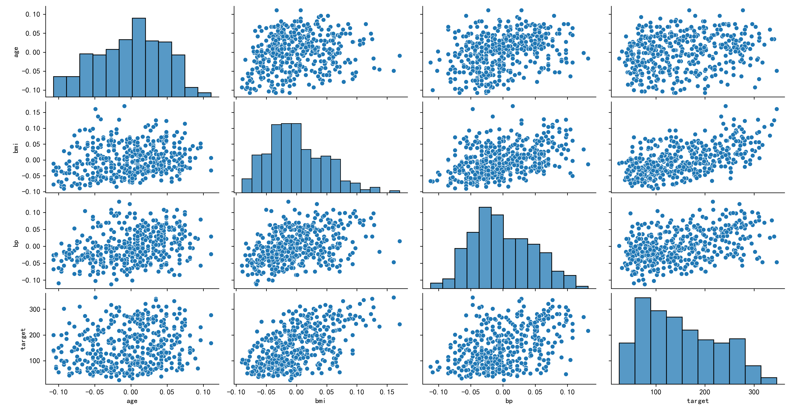
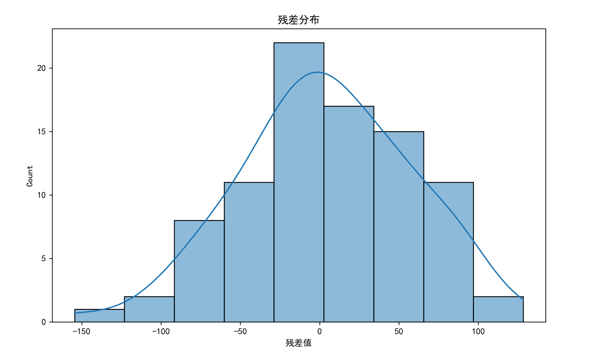
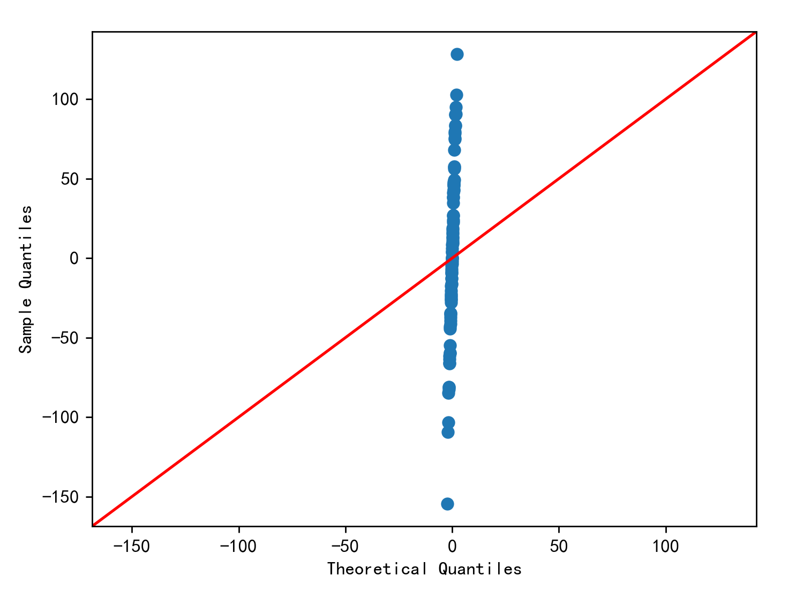
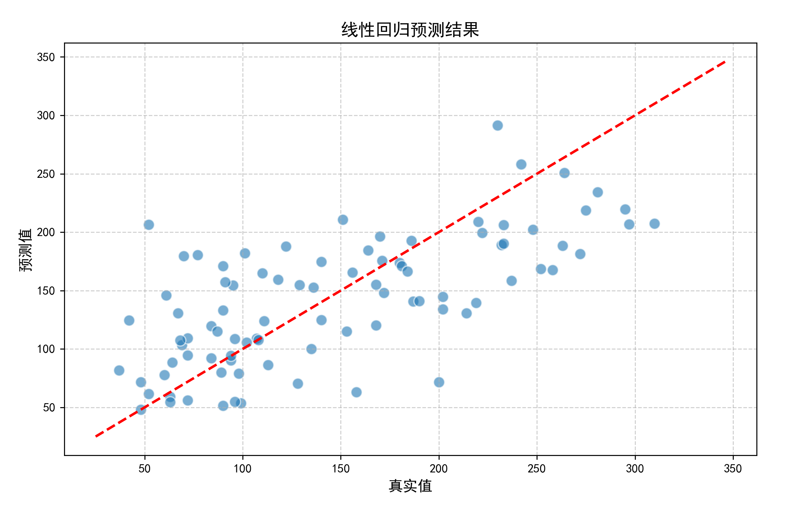
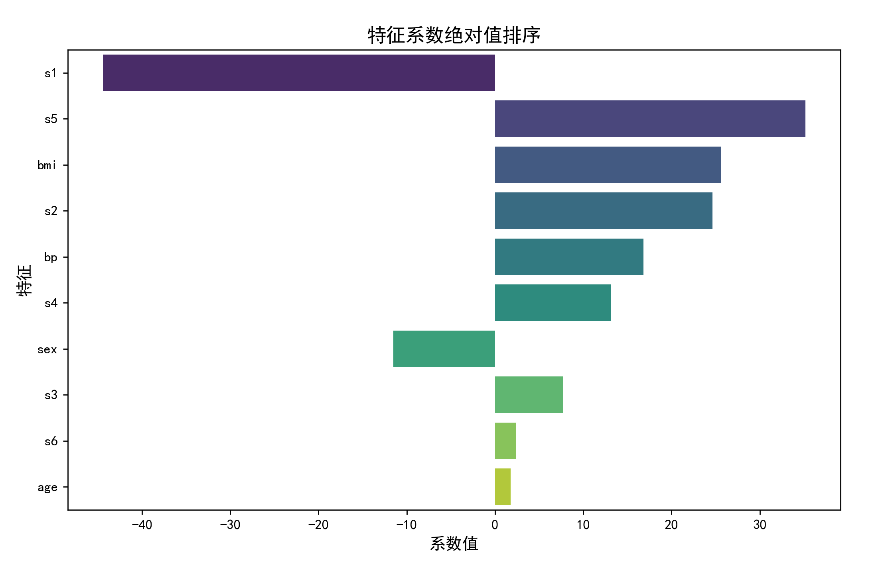

# 线性回归

## 一、线性回归理论基础

### 1. 模型定义与核心思想
线性回归（Linear Regression）是建立自变量（特征）$X$与因变量（目标）$y$之间线性关系的统计模型。其核心目标是找到一组系数 $\beta$，使得预测值与真实值的残差平方和最小。

#### 定义模型
对于 $n$个样本和 $m$个特征，线性回归模型的表达式为：
$$
y = \beta_0 + \beta_1 x_1 + \beta_2 x_2 + \dots + \beta_m x_m + \epsilon
$$
- $y$：因变量（目标值）
- $\beta_0$：截距项（模型在特征全为0时的基准值）
- $\beta_1, \dots, \beta_m$：特征系数（每个特征对目标的贡献权重）
- $\epsilon$：误差项（服从 $\epsilon \sim \mathcal{N}(0, \sigma^2)$）

#### 核心假设
1. **线性性**：$E(y|X) = X\beta$（目标值是特征的线性组合）
2. **独立性**：样本间误差项相互独立，即 $\text{Cov}(\epsilon_i, \epsilon_j) = 0 \ (i \neq j)$
3. **同方差性**：$\text{Var}(\epsilon) = \sigma^2 I$（误差方差恒定）
4. **无多重共线性**：$X$列满秩（保证 $X^T X$可逆）
5. **正态性**：$\epsilon \sim \mathcal{N}(0, \sigma^2)$（残差服从正态分布）


### 2. 参数估计方法详述

#### 最小二乘法（OLS）的推导
目标是最小化残差平方和（RSS）：
$$
\text{RSS} = \sum_{i=1}^n (y_i - \hat{y}_i)^2 = (y - X\beta)^T (y - X\beta)
$$
展开后：
$$
\text{RSS} = y^T y - 2 \beta^T X^T y + \beta^T X^T X \beta
$$
对 $\beta$求导并令导数为零：
$$
\frac{\partial \text{RSS}}{\partial \beta} = -2 X^T y + 2 X^T X \beta = 0
$$
解得正规方程：
$$
X^T X \beta = X^T y \quad \Rightarrow \quad \beta = (X^T X)^{-1} X^T y
$$

#### 梯度下降法的数学细节
定义损失函数 $J(\beta) = \frac{1}{2n} \text{RSS}$，梯度计算为：
$$
\nabla J(\beta) = \frac{1}{n} X^T (X\beta - y)
$$
参数更新公式：
$$
\beta^{(t+1)} = \beta^{(t)} - \alpha \nabla J(\beta^{(t)})
$$
其中 $\alpha$为学习率，迭代直到收敛（如损失变化小于阈值 $\epsilon=1e-5$）。

#### 正规方程与梯度下降的对比
| **方法**         | 时间复杂度          | 适用场景                     | 注意事项                     |
|------------------|---------------------|-----------------------------|-----------------------------|
| 正规方程         | $O(m^3)$         | 特征数 $m < 10^4$的小数据 | 需计算矩阵逆，特征需满秩     |
| 梯度下降         | $O(k \cdot m \cdot n)$| 大数据（如 $n > 10^6$）    | 需调参（$\alpha$, 迭代次数） |


## 二、Python第三方库实践（Scikit-Learn）

#### 数据加载与探索

<<< @/ai/ml/linear_model/src/linear_regression_sklearn.py#p1



#### 数据预处理
<<< @/ai/ml/linear_model/src/linear_regression_sklearn.py#p2

#### 模型训练与调优
<<< @/ai/ml/linear_model/src/linear_regression_sklearn.py#p3


```
截距项 (β0): 153.73654390934846
特征系数:
age: 1.7538
sex: -11.5118
bmi: 25.6071
bp: 16.8289
s1: -44.4489
s2: 24.6410
s3: 7.6770
s4: 13.1388
s5: 35.1612
s6: 2.3514
```

```
                age           sex           bmi            bp  ...            s4            s5            s6      target
count  4.420000e+02  4.420000e+02  4.420000e+02  4.420000e+02  ...  4.420000e+02  4.420000e+02  4.420000e+02  442.000000
mean  -2.511817e-19  1.230790e-17 -2.245564e-16 -4.797570e-17  ... -9.042540e-18  9.293722e-17  1.130318e-17  152.133484
std    4.761905e-02  4.761905e-02  4.761905e-02  4.761905e-02  ...  4.761905e-02  4.761905e-02  4.761905e-02   77.093005
min   -1.072256e-01 -4.464164e-02 -9.027530e-02 -1.123988e-01  ... -7.639450e-02 -1.260971e-01 -1.377672e-01   25.000000
25%   -3.729927e-02 -4.464164e-02 -3.422907e-02 -3.665608e-02  ... -3.949338e-02 -3.324559e-02 -3.317903e-02   87.000000
50%    5.383060e-03 -4.464164e-02 -7.283766e-03 -5.670422e-03  ... -2.592262e-03 -1.947171e-03 -1.077698e-03  140.500000
75%    3.807591e-02  5.068012e-02  3.124802e-02  3.564379e-02  ...  3.430886e-02  3.243232e-02  2.791705e-02  211.500000
max    1.107267e-01  5.068012e-02  1.705552e-01  1.320436e-01  ...  1.852344e-01  1.335973e-01  1.356118e-01  346.000000
```


#### 模型评估与诊断
<<< @/ai/ml/linear_model/src/linear_regression_sklearn.py#p4

```
MSE: 2900.19, RMSE: 53.85, R²: 0.45
```



#### 结果可视化
<<< @/ai/ml/linear_model/src/linear_regression_sklearn.py#p5





## 三、Python手动实现线性回归

### 1. 正规方程实现
```python
import numpy as np

class LinearRegressionFromScratch:
    def __init__(self):
        self.coef_ = None  # 特征系数 (β1~βm)
        self.intercept_ = None  # 截距项 (β0)
        self._is_fitted = False  # 模型是否已训练

    def fit(self, X, y):
        """
        训练模型：通过正规方程求解系数
        - X: 特征矩阵 (n_samples, n_features)
        - y: 目标向量 (n_samples,)
        """
        # 添加截距项（全1列）
        X_b = np.c_[np.ones((X.shape[0], 1)), X]
        
        # 计算X^T X和其逆矩阵
        XT_X = X_b.T.dot(X_b)
        XT_X_inv = np.linalg.inv(XT_X)
        
        # 计算X^T y
        XT_y = X_b.T.dot(y)
        
        # 求解参数θ = (X^T X)^{-1} X^T y
        theta = XT_X_inv.dot(XT_y)
        
        # 分离截距项和系数
        self.intercept_ = theta[0]
        self.coef_ = theta[1:]
        self._is_fitted = True

    def predict(self, X):
        """
        预测新样本
        - X: 特征矩阵 (n_samples, n_features)
        """
        if not self._is_fitted:
            raise RuntimeError("模型未训练，请先调用fit()方法")
        return self.intercept_ + X.dot(self.coef_)

    def score(self, X, y):
        """
        计算R²分数
        """
        y_pred = self.predict(X)
        ss_res = np.sum((y - y_pred)**2)
        ss_tot = np.sum((y - np.mean(y))**2
        return 1 - (ss_res / ss_tot)
```

#### 使用示例
```python
# 初始化模型
manual_model = LinearRegressionFromScratch()
manual_model.fit(X_train_scaled, y_train)

# 预测与评估
y_pred_manual = manual_model.predict(X_test_scaled)
print("手动实现模型R²:", manual_model.score(X_test_scaled, y_test))
```


### 2. 梯度下降实现（带学习率自适应）

```python
class GradientDescentLR:
    def __init__(self, learning_rate=0.01, n_iters=1000, tol=1e-4):
        self.lr = learning_rate      # 初始学习率
        self.n_iters = n_iters       # 最大迭代次数
        self.tol = tol               # 收敛阈值
        self.coef_ = None            # 特征系数
        self.intercept_ = None       # 截距项
        self.loss_history = []       # 损失记录

    def _compute_gradient(self, X, y, theta):
        """计算梯度"""
        n_samples = X.shape[0]
        error = X.dot(theta) - y
        gradient = (1/n_samples) * X.T.dot(error)
        return gradient

    def fit(self, X, y):
        """训练模型"""
        # 添加截距项列
        X_b = np.c_[np.ones((X.shape[0], 1)), X]
        n_samples, n_features = X_b.shape
        
        # 初始化参数：θ = [β0, β1, ..., βm]
        theta = np.random.randn(n_features)
        
        # 梯度下降迭代
        for i in range(self.n_iters):
            gradient = self._compute_gradient(X_b, y, theta)
            theta_prev = theta.copy()
            theta -= self.lr * gradient
            
            # 动态调整学习率：损失未下降则缩小学习率
            loss = np.mean((X_b.dot(theta) - y)**2)
            if i > 0 and loss > self.loss_history[-1]:
                self.lr *= 0.5  # 学习率减半
            self.loss_history.append(loss)
            
            # 检查收敛条件
            if np.linalg.norm(theta - theta_prev) < self.tol:
                print(f"第{i}次迭代后收敛")
                break
        
        # 保存参数
        self.intercept_ = theta[0]
        self.coef_ = theta[1:]

    def predict(self, X):
        """预测"""
        X_b = np.c_[np.ones((X.shape[0], 1)), X]
        return X_b.dot(np.r_[self.intercept_, self.coef_])
```

#### 使用示例
```python
# 初始化模型（需标准化数据）
gd_model = GradientDescentLR(learning_rate=0.1, n_iters=5000)
gd_model.fit(X_train_scaled, y_train)

# 绘制损失曲线
plt.plot(gd_model.loss_history)
plt.title("梯度下降损失曲线")
plt.xlabel("迭代次数")
plt.ylabel("MSE")
plt.show()
```


## 四、进阶话题与最佳实践

### 1. 假设检验与模型诊断
#### 残差分析
- **正态性检验**：使用K-S检验或Q-Q图验证残差是否服从正态分布。
- **异方差性检测**：绘制残差 vs 预测值图，若呈现漏斗状则存在异方差。
- **自相关检验**：Durbin-Watson统计量（值接近2表明无自相关）。

#### 多重共线性诊断
- **方差膨胀因子（VIF）**：
  $$
  \text{VIF}_j = \frac{1}{1 - R_j^2}
  $$
  其中 $R_j^2$是将第 $j$个特征对其他特征回归的R²值。VIF > 5 表明存在共线性。

### 2. 正则化方法扩展
#### 岭回归（Ridge Regression）
在损失函数中添加L2正则化项：
$$
J(\beta) = \frac{1}{2n} \|y - X\beta\|^2 + \lambda \|\beta\|^2
$$
求解：
$$
\beta = (X^T X + \lambda I)^{-1} X^T y
$$
Scikit-Learn实现：
```python
from sklearn.linear_model import Ridge
ridge = Ridge(alpha=1.0)
ridge.fit(X_train_scaled, y_train)
```

#### Lasso回归（L1正则化）
添加L1正则化项实现特征选择：
$$
J(\beta) = \frac{1}{2n} \|y - X\beta\|^2 + \lambda \|\beta\|_1
$$
实现：
```python
from sklearn.linear_model import Lasso
lasso = Lasso(alpha=0.1)
lasso.fit(X_train_scaled, y_train)
```


### 3. 模型选择与超参数调优
#### 交叉验证
```python
from sklearn.model_selection import cross_val_score
scores = cross_val_score(LinearRegression(), X, y, cv=5, scoring='r2')
print("交叉验证R²均值:", np.mean(scores))
```

#### 网格搜索（以岭回归为例）
```python
from sklearn.model_selection import GridSearchCV

param_grid = {'alpha': [0.001, 0.01, 0.1, 1, 10]}
grid = GridSearchCV(Ridge(), param_grid, cv=5, scoring='neg_mean_squared_error')
grid.fit(X_train_scaled, y_train)
print("最佳参数:", grid.best_params_)
```


## 五、完整项目案例：房价预测

### 1. 数据集说明
使用Kaggle房价预测数据集（[House Prices](https://www.kaggle.com/c/house-prices-advanced-regression-techniques)），包含79个特征和1460个样本。

### 2. 完整流程
1. **数据清洗**：处理缺失值（填充或删除）、异常值检测（箱线图）。
2. **特征工程**：
   - 类别特征编码（One-Hot Encoding）
   - 数值特征标准化
   - 创建新特征（如房屋总面积=地下室面积+1楼面积）
3. **模型训练**：
   ```python
   from sklearn.compose import ColumnTransformer
   from sklearn.pipeline import Pipeline
   from sklearn.preprocessing import OneHotEncoder

   # 定义预处理流程
   numeric_features = ['LotArea', 'GrLivArea', ...]
   categorical_features = ['Neighborhood', 'HouseStyle', ...]

   preprocessor = ColumnTransformer(
       transformers=[
           ('num', StandardScaler(), numeric_features),
           ('cat', OneHotEncoder(), categorical_features)
       ])

   # 构建Pipeline
   pipeline = Pipeline(steps=[
       ('preprocessor', preprocessor),
       ('regressor', Ridge(alpha=1.0))
   ])

   # 训练模型
   pipeline.fit(X_train, y_train)
   ```
4. **模型解释**：
   - SHAP值分析特征重要性
   - 部分依赖图（PDP）展示特征与目标关系


## 六、常见问题解答

### Q1：为什么特征需要标准化？
- **梯度下降加速**：不同尺度特征导致收敛缓慢。
- **正则化公平性**：L1/L2惩罚对尺度敏感，需统一量纲。

### Q2：R²为负说明什么？
当模型预测效果比简单使用均值预测更差时，R²可能为负，通常意味着：
- 未正确拟合数据
- 测试集与训练集分布差异大
- 模型选择错误

### Q3：如何处理非线性关系？
- **多项式回归**：添加特征的高次项（如 $x^2, x^3$）
- **样条回归**：分段多项式拟合
- **广义加性模型（GAM）**：自动学习非线性关系

## 七、总结

- **理论基础**：最小二乘法、正规方程、梯度下降、模型假设
- **工程实践**：数据预处理、Scikit-Learn流水线、模型诊断
- **高级技术**：正则化、交叉验证、特征工程
