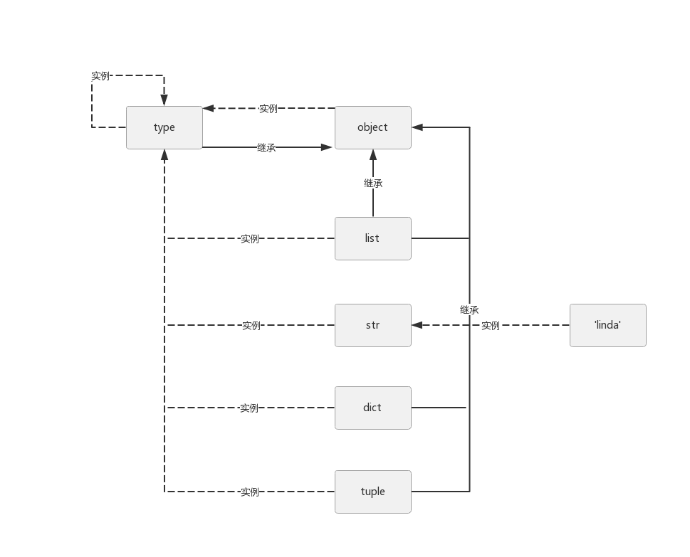

# Python一切皆对象

## 1、Python中一切皆对象

- python是动态语言，面向对象更加彻底
- 函数和类也是对象，属于python的一等公民

> 一等公民的特性：
> - 赋值给一个变量
> - 可以添加到集合对象中
> - 可以作为参数传递给函数
> - 可以当做函数的返回值

```python {cmd="python3"}
def bar(name):
    print('Hello %s' % name)

class Person(object):
    def __init__(self, name):
        print('Hello %s' % name)

def decorator_func():
    print('from decorator_func')
    return bar

def print_type(obj):
    print(type(obj))

# 赋值给一个变量
func = bar
func('Linda')
my_class = Person
my_class('Tom')

# 可以添加到集合对象中
obj_list = []
obj_list.append(bar)
obj_list.append(Person)
for item in obj_list:
    # 可以作为参数传递给函数
    print_type(item)

# 可以当做函数的返回值
deco_bar = decorator_func()
deco_bar('deco_bar')
```

输出结果：
```text
Hello Linda
Hello Tom
<class 'function'>
<class 'type'>
from decorator_func
Hello deco_bar
```

## 2、type、object和class之间的关系

### type实例化常见类型

```python {cmd="python3"}
name = 'linda'
print(type(name))
print(type(int))
print(type(type))
print(type(object))
```

```
<class 'str'>
<class 'type'>
<class 'type'>
<class 'type'>
```

### object 是最顶层基类
```python {cmd="python3"}
print(int.__bases__)
print(type.__bases__)
print(object.__bases__)
```
```
(<class 'object'>,)
(<class 'object'>,)
()
```
### type、object、class关系图



- 把 list，dict 等类做成对象，后续后修改特别方便
- object 是所有类的基类，type 也要继承它
- type 也是自身的实例，一切皆对象，一切继承object

## 3、Python中的内置类型

### 对象的三个特征
- 身份：对象在内存中的地址
- 类型：每个对象都应该有个类型，分类思想
- 值：度量大小

```python {cmd="python3"}
name = 'linda'
print(id(name))
print(type(name))
print(name)
```
```
2107374719664
<class 'str'>
linda
```

### python常见数据类型

- None(全局只有一个)，即解释器启动时定义
- 数值：int、float、complex、bool
- 迭代类型
- 序列类型：list、tuple、str、bytes
- 映射类型：dict
- 集合类型：set、frozenset
- 上下文管理类型：with语句
- 其他：模块类型、class和实例、函数类型、方法类型、代码类型、object对象、type类型、notimplemented类型

set和dict.keys()实现原理相同，较快

>问：这些常见类型是划分的本质是什么呢，又如何自定义这些类型呢
> 答: 魔法函数