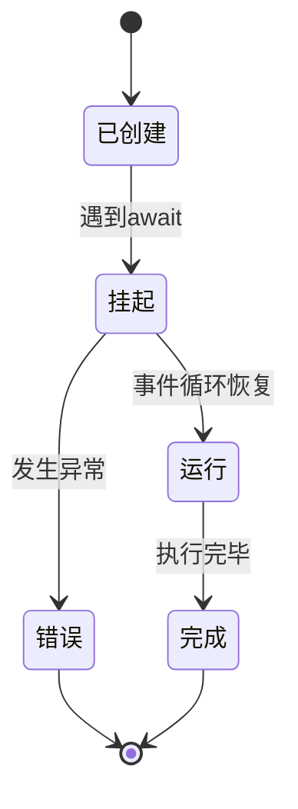
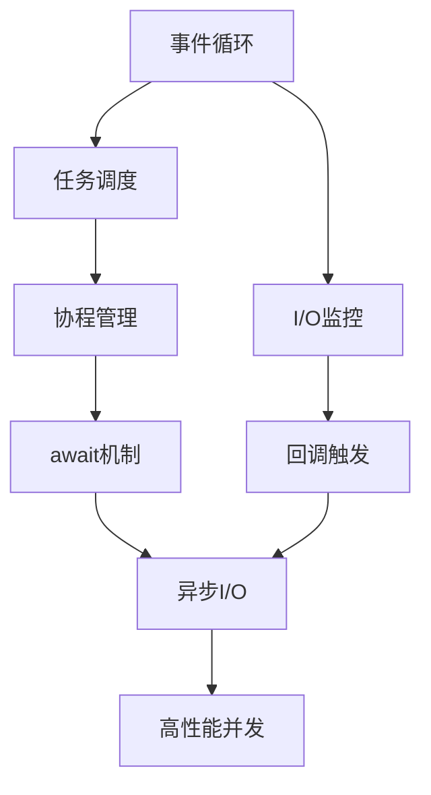

# Python异步编程全景指南

## 第一章：理解程序世界的时空观

### 1.1 同步 vs 异步：两种不同的时空维度
**同步编程**就像单线程的流水线工人：
- 必须严格按照顺序处理每个任务
- 遇到耗时操作（如网络请求）时完全停止
- 适合简单任务，但资源利用率低

```python
import time

def 同步任务():
    print("开始下载A...")
    time.sleep(3)  # 模拟耗时操作
    print("开始下载B...")
    time.sleep(2)
    
同步任务()  # 总耗时5秒
```

**异步编程**则像经验丰富的餐厅经理：
- 可以同时处理多个任务
- 遇到等待时切换处理其他任务
- 通过事件循环(event loop)调度任务
- 适合I/O密集型场景，资源利用率高

```python
import asyncio

async def 异步任务():
    print("开始下载A...")
    await asyncio.sleep(3)  # 非阻塞等待
    print("开始下载B...")
    await asyncio.sleep(2)

asyncio.run(异步任务())  # 总耗时5秒（但可并行处理其他任务）
```

### 1.2 异步编程的三大核心要素
1. **协程(Coroutine)**：
   - 使用`async def`定义的函数
   - 可以被暂停和恢复的特殊函数
   - 需要通过事件循环驱动执行

2. **事件循环(Event Loop)**：
   - 异步程序的中枢神经系统
   - 负责调度和执行协程
   - 监控I/O事件和系统事件

3. **Future/Task**：
   - 表示异步操作的执行状态
   - Task是Future的子类，用于包装协程
   - 提供回调函数等高级功能

## 第二章：协程的魔法原理

### 2.1 协程的生命周期


### 2.2 await关键字的工作原理
当协程执行到`await`表达式时：
1. 挂起当前协程
2. 将控制权交还给事件循环
3. 事件循环检查等待的条件是否满足
4. 当条件满足时恢复协程执行

```python
async def 示例协程():
    print("步骤1")
    await asyncio.sleep(1)  # 挂起点
    print("步骤2")  # 1秒后执行

# 执行过程：
# 1. 创建协程对象
# 2. 通过事件循环驱动执行
# 3. 遇到await时挂起
# 4. 事件循环处理其他任务
# 5. 1秒后恢复执行
```

## 第三章：事件循环的调度艺术

### 3.1 事件循环的运作机制
事件循环的核心是一个无限循环，主要工作流程：
1. 从任务队列获取可执行任务
2. 执行直到遇到await表达式
3. 监控I/O操作和定时器
4. 当条件满足时唤醒对应协程
5. 重复上述过程

```python
# 手动创建事件循环（生产环境通常使用asyncio.run）
loop = asyncio.new_event_loop()
try:
    loop.run_until_complete(主任务())
finally:
    loop.close()
```

### 3.2 任务调度策略
事件循环使用多种队列管理任务：
- **Ready Queue**：立即执行的任务
- **Scheduled Queue**：定时执行的任务
- **I/O Queue**：等待I/O完成的任务

调度优先级：Ready Queue > Scheduled Queue > I/O Queue

## 第四章：异步编程实践模式

### 4.1 并发控制模式
```python
async def 受限任务(semaphore, url):
    async with semaphore:  # 信号量控制并发数
        return await fetch(url)

async def 批量下载():
    sem = asyncio.Semaphore(5)  # 最大并发5
    tasks = [受限任务(sem, url) for url in url_list]
    return await asyncio.gather(*tasks)
```

### 4.2 错误处理策略
```python
async def 安全任务():
    try:
        result = await 可能失败的操作()
    except NetworkError:
        result = await 备用方案()
    finally:
        await 清理资源()
        
async def 超时控制():
    try:
        await asyncio.wait_for(网络请求(), timeout=5)
    except asyncio.TimeoutError:
        print("请求超时")
```

## 第五章：异步生态系统

### 5.1 常用异步库
| 库名称       | 用途                 | 同步库对应       |
|-------------|----------------------|-----------------|
| aiohttp     | HTTP客户端/服务端     | requests        |
| aiomysql    | MySQL数据库访问       | pymysql         |
| aiofiles    | 异步文件操作          | open            |
| websockets  | WebSocket通信         | wsgi            |
| asyncpg     | PostgreSQL访问        | psycopg2        |

### 5.2 异步Web框架对比
| 框架       | 特点                          | 适用场景         |
|-----------|-------------------------------|------------------|
| FastAPI   | 基于类型提示，高性能           | API服务          |
| Sanic     | 类Flask语法，高并发            | Web应用          |
| Tornado   | 全栈式框架，历史悠久           | 长轮询/WebSocket |
| Quart     | 兼容Flask生态的异步框架         | 迁移项目         |

## 第六章：性能优化之道

### 6.1 异步编程性能陷阱
- **阻塞调用**：在协程中使用同步I/O
- **过度并发**：耗尽系统资源
- **回调地狱**：过度嵌套的回调函数
- **内存泄漏**：未正确取消任务

### 6.2 调试与优化工具
1. **asyncio调试模式**：
   ```python
   asyncio.run(主任务(), debug=True)
   ```

2. **性能分析工具**：
   ```python
   from pyinstrument import Profiler

   async def 性能测试():
       with Profiler(async_mode='strict'):
           await 业务逻辑()
   ```

3. **监控指标**：
   - 事件循环延迟
   - 任务队列长度
   - 协程切换频率

## 第七章：从理论到实践

### 7.1 异步爬虫实战
```python
async def 异步爬虫(urls):
    async with aiohttp.ClientSession() as session:
        tasks = [获取页面(session, url) for url in urls]
        return await asyncio.gather(*tasks)

async def 获取页面(session, url):
    async with session.get(url) as response:
        return await response.text()

# 启动100个并发请求
results = asyncio.run(异步爬虫(url_list))
```

### 7.2 实时聊天服务
```python
from websockets import serve

async def 聊天服务(websocket):
    async for message in websocket:
        await 广播消息(message)

async def 广播消息(message):
    for user in 在线用户:
        await user.send(message)

async def 主程序():
    async with serve(聊天服务, "localhost", 8765):
        await asyncio.Future()  # 永久运行

asyncio.run(主程序())
```

## 知识图谱：异步编程核心概念



---

### 深度解析：异步编程的底层逻辑

**1. 生成器与协程的关系**  
Python协程基于生成器实现，通过`yield`和`send()`实现执行权的转移。async/await语法是生成器协程的语法糖，使得代码更易读。

**2. 事件循环的实现机制**  
主流事件循环使用Selector模块监控I/O事件：
- 在Linux系统使用epoll
- 在macOS使用kqueue
- 在Windows使用IOCP

**3. 协程与线程的对比**  
| 特性         | 协程                | 线程             |
|-------------|--------------------|------------------|
| 创建开销     | 极小（约1KB）       | 较大（约8MB）    |
| 切换成本     | 纳秒级              | 微秒级           |
| 并发数量     | 轻松支持数万        | 通常数百         |
| 数据共享     | 无需锁              | 需要同步机制     |
| 适用场景     | I/O密集型           | CPU密集型        |

---

### 学习路线建议

1. **初级阶段**  
   - 掌握async/await基本语法
   - 理解事件循环原理
   - 使用aiohttp进行网络请求

2. **中级阶段**  
   - 学习并发控制模式
   - 掌握错误处理策略
   - 熟悉常用异步库

3. **高级阶段**  
   - 优化异步程序性能
   - 开发异步框架中间件
   - 设计分布式异步系统
