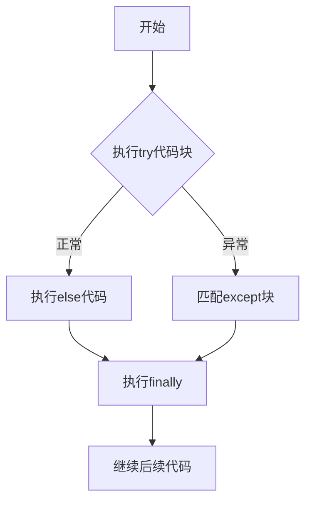

# Python异常处理

## 第一章：理解基本概念

### 1.1 什么是异常？

**生活比喻**：  
就像烹饪时突然发现煤气灶打不着火，程序运行中也会遇到意外情况。异常处理就是提前准备好的应急方案。

**基本术语**：  
- **错误（Error）**：无法恢复的严重问题（如语法错误）  
- **异常（Exception）**：可以捕获处理的意外情况（如文件找不到）  

**常见异常类型**：  
| 异常类型          | 触发场景                 | 示例                  |
|-------------------|--------------------------|-----------------------|
| `ValueError`      | 值不符合预期             | `int('abc')`          |
| `TypeError`       | 类型操作错误             | `1 + '1'`             |
| `IndexError`      | 索引越界                 | `lst=[0]; lst[1]`     |
| `KeyError`        | 字典键不存在             | `d={'a':1}; d['b']`   |
| `FileNotFoundError` | 文件未找到              | `open('nonexist.txt')`|


## 第二章：基础异常处理

### 2.1 使用try-except捕获异常

**代码示例**：  
```python
try:
    # 可能出错的代码
    age = int(input("请输入年龄："))
except ValueError:
    # 处理值错误异常
    print("输入的不是有效数字！")
else:
    # 没有异常时执行
    print(f"您输入的年龄是：{age}")
finally:
    # 无论是否异常都执行
    print("---输入流程结束---")
```

**执行流程图示**：  



## 第三章：处理多种异常

### 3.1 多异常处理方案

**示例场景**：  
处理用户输入的数字计算：  
1. 输入非数字 → ValueError  
2. 除零错误 → ZeroDivisionError  

**带详细注释的代码**：  
```python
def calculate():
    try:
        # 获取用户输入
        num1 = float(input("请输入第一个数字："))
        num2 = float(input("请输入第二个数字："))
        
        # 执行计算
        result = num1 / num2
        
    except ValueError as ve:
        # 处理值错误（输入非数字）
        print(f"输入错误：{ve}")
        print("请确保输入的是有效数字")
        
    except ZeroDivisionError:
        # 处理除零错误
        print("错误：除数不能为零！")
        result = float('inf')  # 返回无穷大
        
    else:
        # 没有异常时显示结果
        print(f"计算结果：{result:.2f}")
        
    finally:
        # 清理资源（如果有）
        print("计算过程结束")

calculate()
```


## 第四章：自定义异常

### 4.1 创建业务异常

**场景说明**：  
验证用户密码强度：  
- 长度不足 → 抛出ShortPasswordError  
- 缺少特殊字符 → 缺少SpecialCharError  

**完整实现代码**：  
```python
# 自定义异常类
class ShortPasswordError(Exception):
    """密码长度不足异常"""
    def __init__(self, length):
        self.length = length
        super().__init__(f"密码至少需要8位，当前长度：{length}")

class MissingSpecialCharError(Exception):
    """缺少特殊字符异常"""
    def __init__(self):
        super().__init__("密码必须包含!@#$%^&*其中一种字符")

def validate_password(password):
    # 检查长度
    if len(password) < 8:
        raise ShortPasswordError(len(password))
    
    # 检查特殊字符
    special_chars = set("!@#$%^&*")
    if not any(char in special_chars for char in password):
        raise MissingSpecialCharError()
    
    return True

# 使用示例
try:
    validate_password("abc123")
except (ShortPasswordError, MissingSpecialCharError) as e:
    print(f"密码验证失败：{e}")
else:
    print("密码符合要求")
```


## 第五章：异常处理最佳实践

### 5.1 实用技巧清单

1. **精确捕获异常**  
```python
# 不推荐（捕获所有异常）
try:
    ...
except:
    pass

# 推荐做法
try:
    ...
except ValueError:
    ...
```

2. **异常链保留**  
```python
try:
    ...
except SomeError as e:
    raise NewError("附加信息") from e
```

3. **日志记录**  
```python
import logging

try:
    ...
except Exception as e:
    logging.error("操作失败", exc_info=True)
```

4. **资源清理**  
```python
file = None
try:
    file = open('data.txt')
    ...
except FileNotFoundError:
    ...
finally:
    if file:  # 确保文件关闭
        file.close()
```

---

## 综合练习：温度转换器

**功能需求**：  
- 将华氏度转换为摄氏度  
- 处理无效输入  
- 允许重复输入  

**完整代码**：  
```python
def fahrenheit_to_celsius(f):
    """华氏度转摄氏度"""
    return (f - 32) * 5/9

while True:
    try:
        input_str = input("请输入华氏温度（输入q退出）：")
        if input_str.lower() == 'q':
            break
            
        f_temp = float(input_str)
        c_temp = fahrenheit_to_celsius(f_temp)
        print(f"{f_temp}华氏度 = {c_temp:.2f}摄氏度")
        
    except ValueError:
        print("错误：请输入有效数字！")
    except KeyboardInterrupt:
        print("\n检测到退出请求...")
        break
    finally:
        print("-" * 30)

print("感谢使用温度转换器！")
```

---

## 常见问题解答

**Q：为什么我的异常没有被捕获？**  
A：检查异常类型是否匹配，可使用基类`Exception`捕获所有异常（不推荐长期使用）

**Q：如何查看完整错误信息？**  
```python
import traceback

try:
    ...
except:
    traceback.print_exc()
```

**Q：该在什么情况下自定义异常？**  
A：当需要表达特定的业务逻辑错误时，比如：  
- 用户权限不足  
- 数据格式不符合要求  
- 业务流程中的特定错误状态  


