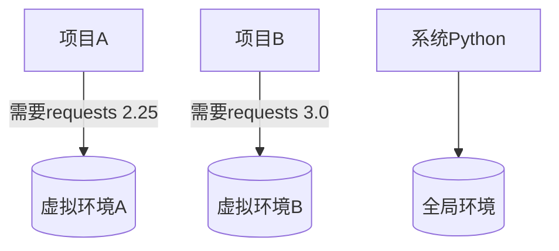

# Python模块化编程

## 模块就像工具箱（基本概念）
**生活比喻**：  
模块就像装满工具的工具箱，包就像存放多个工具箱的仓库。例如：
- `math` 模块：装数学工具（平方根、三角函数等）
- `datetime` 模块：装时间处理工具
- `requests` 包：存放处理网络请求的各种工具

### 1.1 使用现成工具
```python
# 打开数学工具箱
import math

print(math.sqrt(25))    # 使用工具箱里的开平方工具
print(math.pi)          # 使用工具箱里的π值

# 给工具箱起别名（适合长名字）
import numpy as np
print(np.array([1,2,3]))

# 只拿需要的工具（避免工具箱太重）
from os import path
print(path.join('folder', 'file.txt'))
```

## 创建自己的工具箱（自定义模块）

### 2.1 创建模块
新建 `calculator.py` 文件：
```python
"""我的计算器工具箱"""

def add(a, b):
    """加法计算器"""
    return a + b

def multiply(a, b):
    """乘法计算器"""
    return a * b

if __name__ == '__main__':
    # 模块自测代码（当直接运行时执行）
    print("测试加法：", add(2,3))
    print("测试乘法：", multiply(2,3))
```

### 2.2 使用自定义模块
```python
# 方式1：导入整个工具箱
import calculator
print(calculator.add(5,3))

# 方式2：选择需要的工具
from calculator import multiply
print(multiply(5,3))

# 方式3：导入所有工具（慎用）
from calculator import *
print(add(7,2))
```

## 建立工具仓库（包管理）

### 3.1 创建包
文件结构：
```
my_package/
├── __init__.py         # 标识这是一个包
├── math_tools.py       # 数学工具模块
└── string_tools.py     # 字符串工具模块
```

math_tools.py 内容：
```python
def average(numbers):
    return sum(numbers)/len(numbers)
```

string_tools.py 内容：
```python
def reverse(text):
    return text[::-1]
```

### 3.2 使用包
```python
from my_package.math_tools import average
from my_package import string_tools

print(average([1,2,3,4]))     # 输出：2.5
print(string_tools.reverse("Hello"))  # 输出：olleH
```

## 常用标准工具箱推荐

| 模块名      | 功能描述                  | 常用工具                     |
|------------|--------------------------|-----------------------------|
| `os`       | 操作系统交互              | `path.join`, `listdir`      |
| `sys`      | 系统参数管理              | `argv`, `exit`              |
| `datetime` | 日期时间处理              | `datetime.now`, `timedelta` |
| `json`     | JSON数据转换              | `dumps`, `loads`            |
| `re`       | 正则表达式                | `search`, `findall`         |
| `random`   | 随机数生成                | `randint`, `choice`         |

**示例：生成随机密码**
```python
import random
import string

def generate_password(length=8):
    chars = string.ascii_letters + string.digits + '!@#$%'
    return ''.join(random.choice(chars) for _ in range(length))

print("您的随机密码：", generate_password(12))
# 示例输出：3x@9LZ!gT5mK
```

## 安装第三方工具（pip使用指南）

### 5.1 常用命令
```bash
# 安装最新版本
pip install requests

# 安装指定版本
pip install numpy==1.21.0

# 升级包
pip install --upgrade pip

# 卸载包
pip uninstall package-name

# 查看已安装包
pip list

# 导出依赖列表
pip freeze > requirements.txt

# 安装所有依赖
pip install -r requirements.txt
```

### 5.2 国内镜像加速
```bash
# 临时使用清华源
pip install pandas -i https://pypi.tuna.tsinghua.edu.cn/simple

# 永久配置
pip config set global.index-url https://mirrors.aliyun.com/pypi/simple/
```

## 虚拟环境（项目专属工具箱）

### 6.1 创建虚拟环境
```bash
# 创建环境
python -m venv myenv

# 激活环境（Windows）
myenv\Scripts\activate.bat

# 激活环境（Mac/Linux）
source myenv/bin/activate

# 退出环境
deactivate
```

### 6.2 环境管理示意图


## 发布自己的工具箱（PyPI实战）

### 7.1 项目结构
```
my_utils/
├── LICENSE
├── README.md
├── setup.py
└── my_utils/
    ├── __init__.py
    ├── math_utils.py
    └── file_utils.py
```

setup.py 示例：
```python
from setuptools import setup, find_packages

setup(
    name="my_utils",
    version="0.1",
    packages=find_packages(),
    install_requires=['requests>=2.0'],
    author="你的名字",
    description="实用的工具集合"
)
```

### 7.2 发布流程
```bash
# 安装必要工具
pip install setuptools wheel twine

# 打包项目
python setup.py sdist bdist_wheel

# 上传到PyPI
twine upload dist/*
```

## 常见问题排雷

### Q1：找不到模块
```python
# 错误提示
ModuleNotFoundError: No module named 'mymodule'

# 解决方案：
1. 检查文件路径是否正确
2. 查看sys.path添加路径
import sys
sys.path.append("/path/to/module")
```

### Q2：循环导入
```python
# 文件A.py
from B import func_b

# 文件B.py
from A import func_a  # 形成循环

# 解决方案：
1. 合并相关代码到同一模块
2. 在函数内部导入
```

### Q3：版本冲突
```bash
# 查看冲突信息
pip check

# 解决方案：
1. 创建新虚拟环境
2. 使用兼容版本
pip install "package>=1.0,<2.0"
```