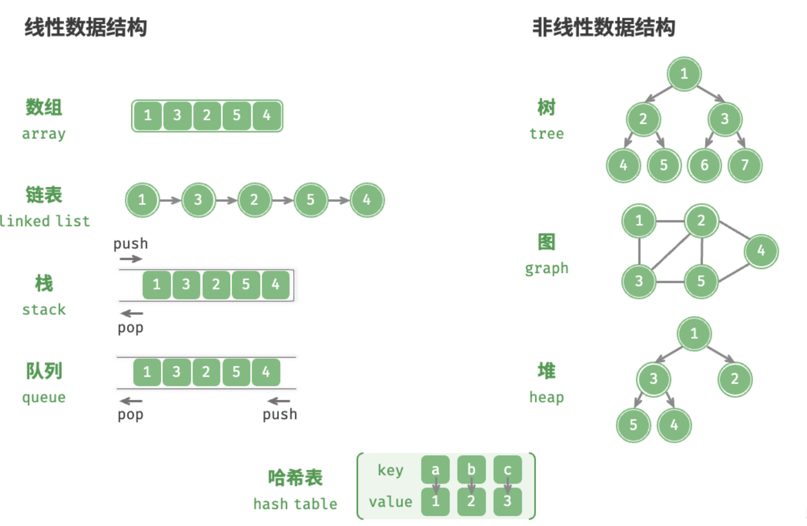
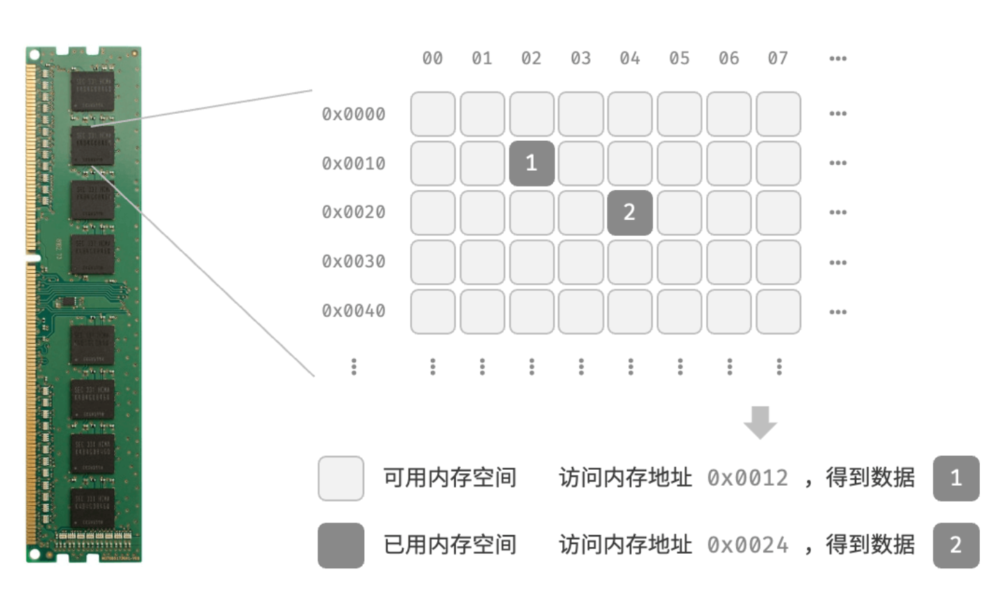
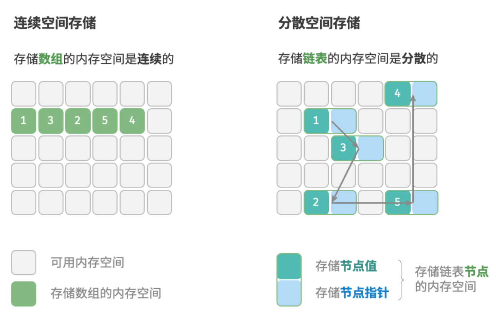
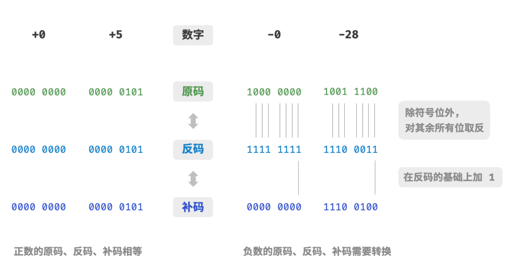
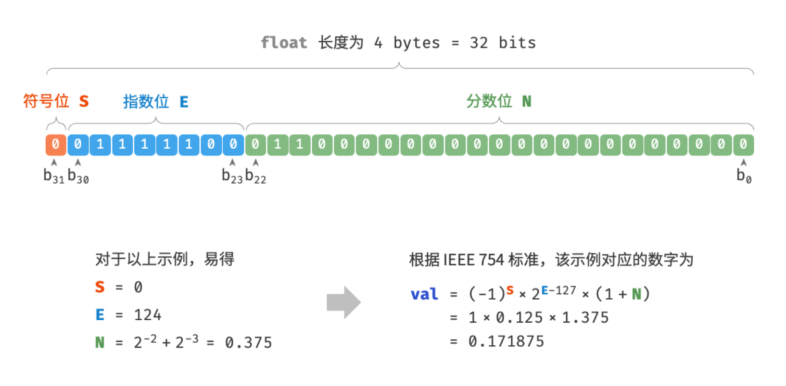

# 数据结构

数据结构如同一副稳固而多样的框架。

它为数据的有序组织提供了蓝图，算法得以在此基础上生动起来。

## 数据结构分类

常见的数据结构包括数组、链表、栈、队列、哈希表、树、堆、图，它们可以从“逻辑结构”和“物理结构”两个维度进行分类。

### 逻辑结构：线性与非线性

逻辑结构揭示了数据元素之间的逻辑关系。在数组和链表中，数据按照一定顺序排列，体现了数据之间的线性关系；而在树中，数据从顶部向下按层次排列，表现出“祖先”与“后代”之间的派生关系；图则由节点和边构成，反映了复杂的网络关系。

如下图所示，逻辑结构可分为“线性”和“非线性”两大类。线性结构比较直观，指数据在逻辑关系上呈线性排列；非线性结构则相反，呈非线性排列。

- 线性数据结构：数组、链表、栈、队列、哈希表，元素之间是一对一的顺序关系。
- 非线性数据结构：树、堆、图、哈希表。

非线性数据结构可以进一步划分为树形结构和网状结构。
- 树形结构：树、堆、哈希表，元素之间是一对多的关系。
- 网状结构：图，元素之间是多对多的关系。



### 物理结构：连续与分散
当算法程序运行时，正在处理的数据主要存储在内存中。下图展示了一个计算机内存条，其中每个黑色方块都包含一块内存空间。我们可以将内存想象成一个巨大的 Excel 表格，其中每个单元格都可以存储一定大小的数据。

系统通过内存地址来访问目标位置的数据。如图 3-2 所示，计算机根据特定规则为表格中的每个单元格分配编号，确保每个内存空间都有唯一的内存地址。有了这些地址，程序便可以访问内存中的数据。



内存是所有程序的共享资源，当某块内存被某个程序占用时，则通常无法被其他程序同时使用了。因此在数据结构与算法的设计中，内存资源是一个重要的考虑因素。比如，算法所占用的内存峰值不应超过系统剩余空闲内存；如果缺少连续大块的内存空间，那么所选用的数据结构必须能够存储在分散的内存空间内。

如图所示，物理结构反映了数据在计算机内存中的存储方式，可分为连续空间存储（数组）和分散空间存储（链表）。物理结构从底层决定了数据的访问、更新、增删等操作方法，两种物理结构在时间效率和空间效率方面呈现出互补的特点。



值得说明的是，所有数据结构都是基于数组、链表或二者的组合实现的。例如，栈和队列既可以使用数组实现，也可以使用链表实现；而哈希表的实现可能同时包含数组和链表。

基于数组可实现：栈、队列、哈希表、树、堆、图、矩阵、张量（维度 $\ge 3$的数组）等。
基于链表可实现：栈、队列、哈希表、树、堆、图等。

链表在初始化后，仍可以在程序运行过程中对其长度进行调整，因此也称“动态数据结构”。数组在初始化后长度不可变，因此也称“静态数据结构”。值得注意的是，数组可通过重新分配内存实现长度变化，从而具备一定的“动态性”。

## 基本数据类型

当谈及计算机中的数据时，我们会想到文本、图片、视频、语音、3D 模型等各种形式。尽管这些数据的组织形式各异，但它们都由各种基本数据类型构成。

**基本数据类型是 CPU 可以直接进行运算的类型**，在算法中直接被使用，主要包括以下几种。

- 整数类型 `byte`、`short`、`int`、`long` 。
- 浮点数类型 `float`、`double` ，用于表示小数。
- 字符类型 `char` ，用于表示各种语言的字母、标点符号甚至表情符号等。
- 布尔类型 `bool` ，用于表示“是”与“否”判断。

**基本数据类型以二进制的形式存储在计算机中**。一个二进制位即为 $1$ 比特。在绝大多数现代操作系统中，$1$ 字节（byte）由 $8$ 比特（bit）组成。

基本数据类型的取值范围取决于其占用的空间大小。下面以 Java 为例。

- 整数类型 `byte` 占用 $1$ 字节 = $8$ 比特 ，可以表示 $2^{8}$ 个数字。
- 整数类型 `int` 占用 $4$ 字节 = $32$ 比特 ，可以表示 $2^{32}$ 个数字。

下表列举了 Java 中各种基本数据类型的占用空间、取值范围和默认值。此表格无须死记硬背，大致理解即可，需要时可以通过查表来回忆。

基本数据类型的占用空间和取值范围

| 类型   | 符号     | 占用空间 | 最小值                   | 最大值                  | 默认值         |
| ------ | -------- | -------- | ------------------------ | ----------------------- | -------------- |
| 整数   | `byte`   | 1 字节   | $-2^7$ ($-128$)          | $2^7 - 1$ ($127$)       | $0$            |
|        | `short`  | 2 字节   | $-2^{15}$                | $2^{15} - 1$            | $0$            |
|        | `int`    | 4 字节   | $-2^{31}$                | $2^{31} - 1$            | $0$            |
|        | `long`   | 8 字节   | $-2^{63}$                | $2^{63} - 1$            | $0$            |
| 浮点数 | `float`  | 4 字节   | $1.175 \times 10^{-38}$  | $3.403 \times 10^{38}$  | $0.0\text{f}$  |
|        | `double` | 8 字节   | $2.225 \times 10^{-308}$ | $1.798 \times 10^{308}$ | $0.0$          |
| 字符   | `char`   | 2 字节   | $0$                      | $2^{16} - 1$            | $0$            |
| 布尔   | `bool`   | 1 字节   | $\text{false}$           | $\text{true}$           | $\text{false}$ |

请注意，上表针对的是 Java 的基本数据类型的情况。每种编程语言都有各自的数据类型定义，它们的占用空间、取值范围和默认值可能会有所不同。

- 在 Python 中，整数类型 `int` 可以是任意大小，只受限于可用内存；浮点数 `float` 是双精度 64 位；没有 `char` 类型，单个字符实际上是长度为 1 的字符串 `str` 。
- C 和 C++ 未明确规定基本数据类型的大小，而因实现和平台各异。上表遵循 LP64 [数据模型](https://en.cppreference.com/w/cpp/language/types#Properties)，其用于包括 Linux 和 macOS 在内的 Unix 64 位操作系统。
- 字符 `char` 的大小在 C 和 C++ 中为 1 字节，在大多数编程语言中取决于特定的字符编码方法，详见“字符编码”章节。
- 即使表示布尔量仅需 1 位（$0$ 或 $1$），它在内存中通常也存储为 1 字节。这是因为现代计算机 CPU 通常将 1 字节作为最小寻址内存单元。

那么，基本数据类型与数据结构之间有什么联系呢？我们知道，数据结构是在计算机中组织与存储数据的方式。这句话的主语是“结构”而非“数据”。

如果想表示“一排数字”，我们自然会想到使用数组。这是因为数组的线性结构可以表示数字的相邻关系和顺序关系，但至于存储的内容是整数 `int`、小数 `float` 还是字符 `char` ，则与“数据结构”无关。

换句话说，**基本数据类型提供了数据的“内容类型”，而数据结构提供了数据的“组织方式”**。例如以下代码，我们用相同的数据结构（数组）来存储与表示不同的基本数据类型，包括 `int`、`float`、`char`、`bool` 等。


```python
# 使用多种基本数据类型来初始化数组
numbers: list[int] = [0] * 5
decimals: list[float] = [0.0] * 5
# Python 的字符实际上是长度为 1 的字符串
characters: list[str] = ['0'] * 5
bools: list[bool] = [False] * 5
# Python 的列表可以自由存储各种基本数据类型和对象引用
data = [0, 0.0, 'a', False, ListNode(0)]
```

## 数字编码


> 在本书中，标题带有 * 符号的是选读章节。如果你时间有限或感到理解困难，可以先跳过，等学完必读章节后再单独攻克。

### 原码、反码和补码

在上一节的表格中我们发现，所有整数类型能够表示的负数都比正数多一个，例如 `byte` 的取值范围是 $[-128, 127]$ 。这个现象比较反直觉，它的内在原因涉及原码、反码、补码的相关知识。

首先需要指出，**数字是以“补码”的形式存储在计算机中的**。在分析这样做的原因之前，首先给出三者的定义。

- **原码**：我们将数字的二进制表示的最高位视为符号位，其中 $0$ 表示正数，$1$ 表示负数，其余位表示数字的值。
- **反码**：正数的反码与其原码相同，负数的反码是对其原码除符号位外的所有位取反。
- **补码**：正数的补码与其原码相同，负数的补码是在其反码的基础上加 $1$ 。

下图展示了原码、反码和补码之间的转换方法。



原码（sign-magnitude）虽然最直观，但存在一些局限性。一方面，**负数的原码不能直接用于运算**。例如在原码下计算 $1 + (-2)$ ，得到的结果是 $-3$ ，这显然是不对的。

$$
\begin{aligned}
& 1 + (-2) \newline
& \rightarrow 0000 \; 0001 + 1000 \; 0010 \newline
& = 1000 \; 0011 \newline
& \rightarrow -3
\end{aligned}
$$

为了解决此问题，计算机引入了<u>反码（1's complement）</u>。如果我们先将原码转换为反码，并在反码下计算 $1 + (-2)$ ，最后将结果从反码转换回原码，则可得到正确结果 $-1$ 。

$$
\begin{aligned}
& 1 + (-2) \newline
& \rightarrow 0000 \; 0001 \; \text{(原码)} + 1000 \; 0010 \; \text{(原码)} \newline
& = 0000 \; 0001 \; \text{(反码)} + 1111  \; 1101 \; \text{(反码)} \newline
& = 1111 \; 1110 \; \text{(反码)} \newline
& = 1000 \; 0001 \; \text{(原码)} \newline
& \rightarrow -1
\end{aligned}
$$

另一方面，**数字零的原码有 $+0$ 和 $-0$ 两种表示方式**。这意味着数字零对应两个不同的二进制编码，这可能会带来歧义。比如在条件判断中，如果没有区分正零和负零，则可能会导致判断结果出错。而如果我们想处理正零和负零歧义，则需要引入额外的判断操作，这可能会降低计算机的运算效率。

$$
\begin{aligned}
+0 & \rightarrow 0000 \; 0000 \newline
-0 & \rightarrow 1000 \; 0000
\end{aligned}
$$

与原码一样，反码也存在正负零歧义问题，因此计算机进一步引入了<u>补码（2's complement）</u>。我们先来观察一下负零的原码、反码、补码的转换过程：

$$
\begin{aligned}
-0 \rightarrow \; & 1000 \; 0000 \; \text{(原码)} \newline
= \; & 1111 \; 1111 \; \text{(反码)} \newline
= 1 \; & 0000 \; 0000 \; \text{(补码)} \newline
\end{aligned}
$$

在负零的反码基础上加 $1$ 会产生进位，但 `byte` 类型的长度只有 8 位，因此溢出到第 9 位的 $1$ 会被舍弃。也就是说，**负零的补码为 $0000 \; 0000$ ，与正零的补码相同**。这意味着在补码表示中只存在一个零，正负零歧义从而得到解决。

还剩最后一个疑惑：`byte` 类型的取值范围是 $[-128, 127]$ ，多出来的一个负数 $-128$ 是如何得到的呢？我们注意到，区间 $[-127, +127]$ 内的所有整数都有对应的原码、反码和补码，并且原码和补码之间可以互相转换。

然而，**补码 $1000 \; 0000$ 是一个例外，它并没有对应的原码**。根据转换方法，我们得到该补码的原码为 $0000 \; 0000$ 。这显然是矛盾的，因为该原码表示数字 $0$ ，它的补码应该是自身。计算机规定这个特殊的补码 $1000 \; 0000$ 代表 $-128$ 。实际上，$(-1) + (-127)$ 在补码下的计算结果就是 $-128$ 。

$$
\begin{aligned}
& (-127) + (-1) \newline
& \rightarrow 1111 \; 1111 \; \text{(原码)} + 1000 \; 0001 \; \text{(原码)} \newline
& = 1000 \; 0000 \; \text{(反码)} + 1111  \; 1110 \; \text{(反码)} \newline
& = 1000 \; 0001 \; \text{(补码)} + 1111  \; 1111 \; \text{(补码)} \newline
& = 1000 \; 0000 \; \text{(补码)} \newline
& \rightarrow -128
\end{aligned}
$$

你可能已经发现了，上述所有计算都是加法运算。这暗示着一个重要事实：**计算机内部的硬件电路主要是基于加法运算设计的**。这是因为加法运算相对于其他运算（比如乘法、除法和减法）来说，硬件实现起来更简单，更容易进行并行化处理，运算速度更快。

请注意，这并不意味着计算机只能做加法。**通过将加法与一些基本逻辑运算结合，计算机能够实现各种其他的数学运算**。例如，计算减法 $a - b$ 可以转换为计算加法 $a + (-b)$ ；计算乘法和除法可以转换为计算多次加法或减法。

现在我们可以总结出计算机使用补码的原因：基于补码表示，计算机可以用同样的电路和操作来处理正数和负数的加法，不需要设计特殊的硬件电路来处理减法，并且无须特别处理正负零的歧义问题。这大大简化了硬件设计，提高了运算效率。

补码的设计非常精妙，因篇幅关系我们就先介绍到这里，建议有兴趣的读者进一步深入了解。

### 浮点数编码

细心的你可能会发现：`int` 和 `float` 长度相同，都是 4 字节 ，但为什么 `float` 的取值范围远大于 `int` ？这非常反直觉，因为按理说 `float` 需要表示小数，取值范围应该变小才对。

实际上，**这是因为浮点数 `float` 采用了不同的表示方式**。记一个 32 比特长度的二进制数为：

$$
b_{31} b_{30} b_{29} \ldots b_2 b_1 b_0
$$

根据 IEEE 754 标准，32-bit 长度的 `float` 由以下三个部分构成。

- 符号位 $\mathrm{S}$ ：占 1 位 ，对应 $b_{31}$ 。
- 指数位 $\mathrm{E}$ ：占 8 位 ，对应 $b_{30} b_{29} \ldots b_{23}$ 。
- 分数位 $\mathrm{N}$ ：占 23 位 ，对应 $b_{22} b_{21} \ldots b_0$ 。

二进制数 `float` 对应值的计算方法为：

$$
\text {val} = (-1)^{b_{31}} \times 2^{\left(b_{30} b_{29} \ldots b_{23}\right)_2-127} \times\left(1 . b_{22} b_{21} \ldots b_0\right)_2
$$

转化到十进制下的计算公式为：

$$
\text {val}=(-1)^{\mathrm{S}} \times 2^{\mathrm{E} -127} \times (1 + \mathrm{N})
$$

其中各项的取值范围为：

$$
\begin{aligned}
\mathrm{S} \in & \{ 0, 1\}, \quad \mathrm{E} \in \{ 1, 2, \dots, 254 \} \newline
(1 + \mathrm{N}) = & (1 + \sum_{i=1}^{23} b_{23-i} 2^{-i}) \subset [1, 2 - 2^{-23}]
\end{aligned}
$$



观察上图，给定一个示例数据 $\mathrm{S} = 0$ ， $\mathrm{E} = 124$ ，$\mathrm{N} = 2^{-2} + 2^{-3} = 0.375$ ，则有：

$$
\text { val } = (-1)^0 \times 2^{124 - 127} \times (1 + 0.375) = 0.171875
$$

现在我们可以回答最初的问题：**`float` 的表示方式包含指数位，导致其取值范围远大于 `int`** 。根据以上计算，`float` 可表示的最大正数为 $2^{254 - 127} \times (2 - 2^{-23}) \approx 3.4 \times 10^{38}$ ，切换符号位便可得到最小负数。

**尽管浮点数 `float` 扩展了取值范围，但其副作用是牺牲了精度**。整数类型 `int` 将全部 32 比特用于表示数字，数字是均匀分布的；而由于指数位的存在，浮点数 `float` 的数值越大，相邻两个数字之间的差值就会趋向越大。

如下表所示，指数位 $\mathrm{E} = 0$ 和 $\mathrm{E} = 255$ 具有特殊含义，**用于表示零、无穷大、$\mathrm{NaN}$ 等**。

指数位含义

| 指数位 E           | 分数位 $\mathrm{N} = 0$ | 分数位 $\mathrm{N} \ne 0$ | 计算公式                                                               |
| ------------------ | ----------------------- | ------------------------- | ---------------------------------------------------------------------- |
| $0$                | $\pm 0$                 | 次正规数                  | $(-1)^{\mathrm{S}} \times 2^{-126} \times (0.\mathrm{N})$              |
| $1, 2, \dots, 254$ | 正规数                  | 正规数                    | $(-1)^{\mathrm{S}} \times 2^{(\mathrm{E} -127)} \times (1.\mathrm{N})$ |
| $255$              | $\pm \infty$            | $\mathrm{NaN}$            |                                                                        |

值得说明的是，次正规数显著提升了浮点数的精度。最小正正规数为 $2^{-126}$ ，最小正次正规数为 $2^{-126} \times 2^{-23}$ 。

双精度 `double` 也采用类似于 `float` 的表示方法，在此不做赘述。