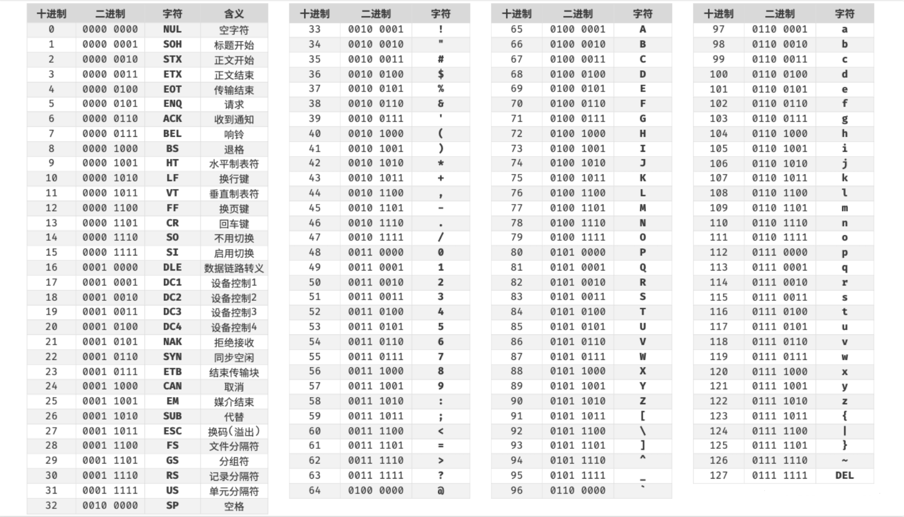
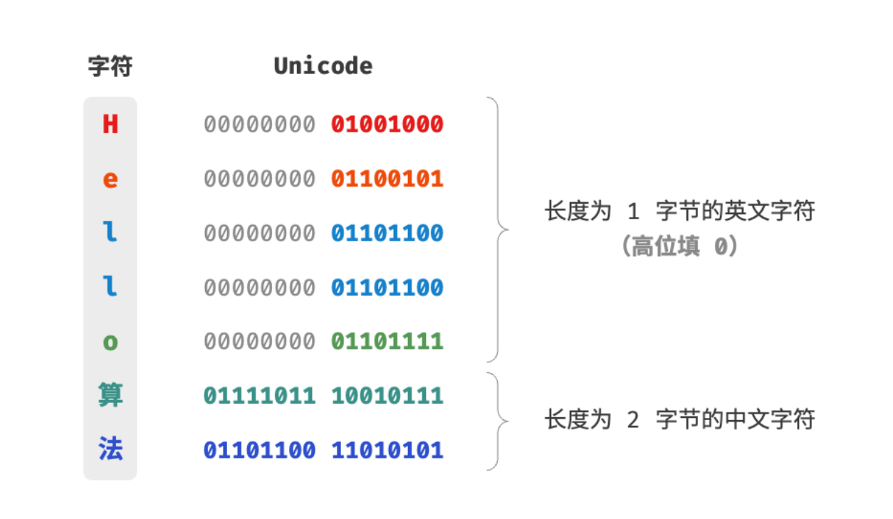
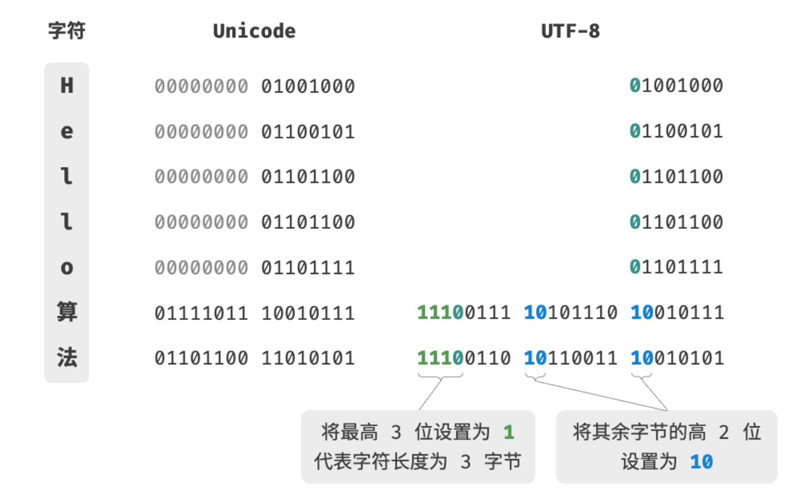

# 数据结构

数据结构如同一副稳固而多样的框架。

它为数据的有序组织提供了蓝图，算法得以在此基础上生动起来。

## 数据结构分类

常见的数据结构包括数组、链表、栈、队列、哈希表、树、堆、图，它们可以从“逻辑结构”和“物理结构”两个维度进行分类。

### 逻辑结构：线性与非线性

逻辑结构揭示了数据元素之间的逻辑关系。在数组和链表中，数据按照一定顺序排列，体现了数据之间的线性关系；而在树中，数据从顶部向下按层次排列，表现出“祖先”与“后代”之间的派生关系；图则由节点和边构成，反映了复杂的网络关系。

如下图所示，逻辑结构可分为“线性”和“非线性”两大类。线性结构比较直观，指数据在逻辑关系上呈线性排列；非线性结构则相反，呈非线性排列。

- 线性数据结构：数组、链表、栈、队列、哈希表，元素之间是一对一的顺序关系。
- 非线性数据结构：树、堆、图、哈希表。

非线性数据结构可以进一步划分为树形结构和网状结构。
- 树形结构：树、堆、哈希表，元素之间是一对多的关系。
- 网状结构：图，元素之间是多对多的关系。


### 物理结构：连续与分散
当算法程序运行时，正在处理的数据主要存储在内存中。下图展示了一个计算机内存条，其中每个黑色方块都包含一块内存空间。我们可以将内存想象成一个巨大的 Excel 表格，其中每个单元格都可以存储一定大小的数据。

系统通过内存地址来访问目标位置的数据。如图 3-2 所示，计算机根据特定规则为表格中的每个单元格分配编号，确保每个内存空间都有唯一的内存地址。有了这些地址，程序便可以访问内存中的数据。


内存是所有程序的共享资源，当某块内存被某个程序占用时，则通常无法被其他程序同时使用了。因此在数据结构与算法的设计中，内存资源是一个重要的考虑因素。比如，算法所占用的内存峰值不应超过系统剩余空闲内存；如果缺少连续大块的内存空间，那么所选用的数据结构必须能够存储在分散的内存空间内。

如图所示，物理结构反映了数据在计算机内存中的存储方式，可分为连续空间存储（数组）和分散空间存储（链表）。物理结构从底层决定了数据的访问、更新、增删等操作方法，两种物理结构在时间效率和空间效率方面呈现出互补的特点。


值得说明的是，所有数据结构都是基于数组、链表或二者的组合实现的。例如，栈和队列既可以使用数组实现，也可以使用链表实现；而哈希表的实现可能同时包含数组和链表。

基于数组可实现：栈、队列、哈希表、树、堆、图、矩阵、张量（维度 $\ge 3$的数组）等。
基于链表可实现：栈、队列、哈希表、树、堆、图等。

链表在初始化后，仍可以在程序运行过程中对其长度进行调整，因此也称“动态数据结构”。数组在初始化后长度不可变，因此也称“静态数据结构”。值得注意的是，数组可通过重新分配内存实现长度变化，从而具备一定的“动态性”。

## 基本数据类型

当谈及计算机中的数据时，我们会想到文本、图片、视频、语音、3D 模型等各种形式。尽管这些数据的组织形式各异，但它们都由各种基本数据类型构成。

**基本数据类型是 CPU 可以直接进行运算的类型**，在算法中直接被使用，主要包括以下几种。

- 整数类型 `byte`、`short`、`int`、`long` 。
- 浮点数类型 `float`、`double` ，用于表示小数。
- 字符类型 `char` ，用于表示各种语言的字母、标点符号甚至表情符号等。
- 布尔类型 `bool` ，用于表示“是”与“否”判断。

**基本数据类型以二进制的形式存储在计算机中**。一个二进制位即为 $1$ 比特。在绝大多数现代操作系统中，$1$ 字节（byte）由 $8$ 比特（bit）组成。

基本数据类型的取值范围取决于其占用的空间大小。下面以 Java 为例。

- 整数类型 `byte` 占用 $1$ 字节 = $8$ 比特 ，可以表示 $2^{8}$ 个数字。
- 整数类型 `int` 占用 $4$ 字节 = $32$ 比特 ，可以表示 $2^{32}$ 个数字。

下表列举了 Java 中各种基本数据类型的占用空间、取值范围和默认值。此表格无须死记硬背，大致理解即可，需要时可以通过查表来回忆。

基本数据类型的占用空间和取值范围

| 类型   | 符号     | 占用空间 | 最小值                   | 最大值                  | 默认值         |
| ------ | -------- | -------- | ------------------------ | ----------------------- | -------------- |
| 整数   | `byte`   | 1 字节   | $-2^7$ ($-128$)          | $2^7 - 1$ ($127$)       | $0$            |
|        | `short`  | 2 字节   | $-2^{15}$                | $2^{15} - 1$            | $0$            |
|        | `int`    | 4 字节   | $-2^{31}$                | $2^{31} - 1$            | $0$            |
|        | `long`   | 8 字节   | $-2^{63}$                | $2^{63} - 1$            | $0$            |
| 浮点数 | `float`  | 4 字节   | $1.175 \times 10^{-38}$  | $3.403 \times 10^{38}$  | $0.0\text{f}$  |
|        | `double` | 8 字节   | $2.225 \times 10^{-308}$ | $1.798 \times 10^{308}$ | $0.0$          |
| 字符   | `char`   | 2 字节   | $0$                      | $2^{16} - 1$            | $0$            |
| 布尔   | `bool`   | 1 字节   | $\text{false}$           | $\text{true}$           | $\text{false}$ |

请注意，上表针对的是 Java 的基本数据类型的情况。每种编程语言都有各自的数据类型定义，它们的占用空间、取值范围和默认值可能会有所不同。

- 在 Python 中，整数类型 `int` 可以是任意大小，只受限于可用内存；浮点数 `float` 是双精度 64 位；没有 `char` 类型，单个字符实际上是长度为 1 的字符串 `str` 。
- C 和 C++ 未明确规定基本数据类型的大小，而因实现和平台各异。上表遵循 LP64 [数据模型](https://en.cppreference.com/w/cpp/language/types#Properties)，其用于包括 Linux 和 macOS 在内的 Unix 64 位操作系统。
- 字符 `char` 的大小在 C 和 C++ 中为 1 字节，在大多数编程语言中取决于特定的字符编码方法，详见“字符编码”章节。
- 即使表示布尔量仅需 1 位（$0$ 或 $1$），它在内存中通常也存储为 1 字节。这是因为现代计算机 CPU 通常将 1 字节作为最小寻址内存单元。

那么，基本数据类型与数据结构之间有什么联系呢？我们知道，数据结构是在计算机中组织与存储数据的方式。这句话的主语是“结构”而非“数据”。

如果想表示“一排数字”，我们自然会想到使用数组。这是因为数组的线性结构可以表示数字的相邻关系和顺序关系，但至于存储的内容是整数 `int`、小数 `float` 还是字符 `char` ，则与“数据结构”无关。

换句话说，**基本数据类型提供了数据的“内容类型”，而数据结构提供了数据的“组织方式”**。例如以下代码，我们用相同的数据结构（数组）来存储与表示不同的基本数据类型，包括 `int`、`float`、`char`、`bool` 等。


```python
# 使用多种基本数据类型来初始化数组
numbers: list[int] = [0] * 5
decimals: list[float] = [0.0] * 5
# Python 的字符实际上是长度为 1 的字符串
characters: list[str] = ['0'] * 5
bools: list[bool] = [False] * 5
# Python 的列表可以自由存储各种基本数据类型和对象引用
data = [0, 0.0, 'a', False, ListNode(0)]
```

## 数字编码


> 在本书中，标题带有 * 符号的是选读章节。如果你时间有限或感到理解困难，可以先跳过，等学完必读章节后再单独攻克。

### 原码、反码和补码

在上一节的表格中我们发现，所有整数类型能够表示的负数都比正数多一个，例如 `byte` 的取值范围是 $[-128, 127]$ 。这个现象比较反直觉，它的内在原因涉及原码、反码、补码的相关知识。

首先需要指出，**数字是以“补码”的形式存储在计算机中的**。在分析这样做的原因之前，首先给出三者的定义。

- **原码**：我们将数字的二进制表示的最高位视为符号位，其中 $0$ 表示正数，$1$ 表示负数，其余位表示数字的值。
- **反码**：正数的反码与其原码相同，负数的反码是对其原码除符号位外的所有位取反。
- **补码**：正数的补码与其原码相同，负数的补码是在其反码的基础上加 $1$ 。

下图展示了原码、反码和补码之间的转换方法。


原码（sign-magnitude）虽然最直观，但存在一些局限性。一方面，**负数的原码不能直接用于运算**。例如在原码下计算 $1 + (-2)$ ，得到的结果是 $-3$ ，这显然是不对的。

$$
\begin{aligned}
& 1 + (-2) \newline
& \rightarrow 0000 \; 0001 + 1000 \; 0010 \newline
& = 1000 \; 0011 \newline
& \rightarrow -3
\end{aligned}
$$

为了解决此问题，计算机引入了<u>反码（1's complement）</u>。如果我们先将原码转换为反码，并在反码下计算 $1 + (-2)$ ，最后将结果从反码转换回原码，则可得到正确结果 $-1$ 。

$$
\begin{aligned}
& 1 + (-2) \newline
& \rightarrow 0000 \; 0001 \; \text{(原码)} + 1000 \; 0010 \; \text{(原码)} \newline
& = 0000 \; 0001 \; \text{(反码)} + 1111  \; 1101 \; \text{(反码)} \newline
& = 1111 \; 1110 \; \text{(反码)} \newline
& = 1000 \; 0001 \; \text{(原码)} \newline
& \rightarrow -1
\end{aligned}
$$

另一方面，**数字零的原码有 $+0$ 和 $-0$ 两种表示方式**。这意味着数字零对应两个不同的二进制编码，这可能会带来歧义。比如在条件判断中，如果没有区分正零和负零，则可能会导致判断结果出错。而如果我们想处理正零和负零歧义，则需要引入额外的判断操作，这可能会降低计算机的运算效率。

$$
\begin{aligned}
+0 & \rightarrow 0000 \; 0000 \newline
-0 & \rightarrow 1000 \; 0000
\end{aligned}
$$

与原码一样，反码也存在正负零歧义问题，因此计算机进一步引入了<u>补码（2's complement）</u>。我们先来观察一下负零的原码、反码、补码的转换过程：

$$
\begin{aligned}
-0 \rightarrow \; & 1000 \; 0000 \; \text{(原码)} \newline
= \; & 1111 \; 1111 \; \text{(反码)} \newline
= 1 \; & 0000 \; 0000 \; \text{(补码)} \newline
\end{aligned}
$$

在负零的反码基础上加 $1$ 会产生进位，但 `byte` 类型的长度只有 8 位，因此溢出到第 9 位的 $1$ 会被舍弃。也就是说，**负零的补码为 $0000 \; 0000$ ，与正零的补码相同**。这意味着在补码表示中只存在一个零，正负零歧义从而得到解决。

还剩最后一个疑惑：`byte` 类型的取值范围是 $[-128, 127]$ ，多出来的一个负数 $-128$ 是如何得到的呢？我们注意到，区间 $[-127, +127]$ 内的所有整数都有对应的原码、反码和补码，并且原码和补码之间可以互相转换。

然而，**补码 $1000 \; 0000$ 是一个例外，它并没有对应的原码**。根据转换方法，我们得到该补码的原码为 $0000 \; 0000$ 。这显然是矛盾的，因为该原码表示数字 $0$ ，它的补码应该是自身。计算机规定这个特殊的补码 $1000 \; 0000$ 代表 $-128$ 。实际上，$(-1) + (-127)$ 在补码下的计算结果就是 $-128$ 。

$$
\begin{aligned}
& (-127) + (-1) \newline
& \rightarrow 1111 \; 1111 \; \text{(原码)} + 1000 \; 0001 \; \text{(原码)} \newline
& = 1000 \; 0000 \; \text{(反码)} + 1111  \; 1110 \; \text{(反码)} \newline
& = 1000 \; 0001 \; \text{(补码)} + 1111  \; 1111 \; \text{(补码)} \newline
& = 1000 \; 0000 \; \text{(补码)} \newline
& \rightarrow -128
\end{aligned}
$$

你可能已经发现了，上述所有计算都是加法运算。这暗示着一个重要事实：**计算机内部的硬件电路主要是基于加法运算设计的**。这是因为加法运算相对于其他运算（比如乘法、除法和减法）来说，硬件实现起来更简单，更容易进行并行化处理，运算速度更快。

请注意，这并不意味着计算机只能做加法。**通过将加法与一些基本逻辑运算结合，计算机能够实现各种其他的数学运算**。例如，计算减法 $a - b$ 可以转换为计算加法 $a + (-b)$ ；计算乘法和除法可以转换为计算多次加法或减法。

现在我们可以总结出计算机使用补码的原因：基于补码表示，计算机可以用同样的电路和操作来处理正数和负数的加法，不需要设计特殊的硬件电路来处理减法，并且无须特别处理正负零的歧义问题。这大大简化了硬件设计，提高了运算效率。

补码的设计非常精妙，因篇幅关系我们就先介绍到这里，建议有兴趣的读者进一步深入了解。

### 浮点数编码

细心的你可能会发现：`int` 和 `float` 长度相同，都是 4 字节 ，但为什么 `float` 的取值范围远大于 `int` ？这非常反直觉，因为按理说 `float` 需要表示小数，取值范围应该变小才对。

实际上，**这是因为浮点数 `float` 采用了不同的表示方式**。记一个 32 比特长度的二进制数为：

$$
b_{31} b_{30} b_{29} \ldots b_2 b_1 b_0
$$

根据 IEEE 754 标准，32-bit 长度的 `float` 由以下三个部分构成。

- 符号位 $\mathrm{S}$ ：占 1 位 ，对应 $b_{31}$ 。
- 指数位 $\mathrm{E}$ ：占 8 位 ，对应 $b_{30} b_{29} \ldots b_{23}$ 。
- 分数位 $\mathrm{N}$ ：占 23 位 ，对应 $b_{22} b_{21} \ldots b_0$ 。

二进制数 `float` 对应值的计算方法为：

$$
\text {val} = (-1)^{b_{31}} \times 2^{\left(b_{30} b_{29} \ldots b_{23}\right)_2-127} \times\left(1 . b_{22} b_{21} \ldots b_0\right)_2
$$

转化到十进制下的计算公式为：

$$
\text {val}=(-1)^{\mathrm{S}} \times 2^{\mathrm{E} -127} \times (1 + \mathrm{N})
$$

其中各项的取值范围为：

$$
\begin{aligned}
\mathrm{S} \in & \{ 0, 1\}, \quad \mathrm{E} \in \{ 1, 2, \dots, 254 \} \newline
(1 + \mathrm{N}) = & (1 + \sum_{i=1}^{23} b_{23-i} 2^{-i}) \subset [1, 2 - 2^{-23}]
\end{aligned}
$$


观察上图，给定一个示例数据 $\mathrm{S} = 0$ ， $\mathrm{E} = 124$ ，$\mathrm{N} = 2^{-2} + 2^{-3} = 0.375$ ，则有：

$$
\text { val } = (-1)^0 \times 2^{124 - 127} \times (1 + 0.375) = 0.171875
$$

现在我们可以回答最初的问题：**`float` 的表示方式包含指数位，导致其取值范围远大于 `int`** 。根据以上计算，`float` 可表示的最大正数为 $2^{254 - 127} \times (2 - 2^{-23}) \approx 3.4 \times 10^{38}$ ，切换符号位便可得到最小负数。

**尽管浮点数 `float` 扩展了取值范围，但其副作用是牺牲了精度**。整数类型 `int` 将全部 32 比特用于表示数字，数字是均匀分布的；而由于指数位的存在，浮点数 `float` 的数值越大，相邻两个数字之间的差值就会趋向越大。

如下表所示，指数位 $\mathrm{E} = 0$ 和 $\mathrm{E} = 255$ 具有特殊含义，**用于表示零、无穷大、$\mathrm{NaN}$ 等**。

指数位含义

| 指数位 E           | 分数位 $\mathrm{N} = 0$ | 分数位 $\mathrm{N} \ne 0$ | 计算公式                                                               |
| ------------------ | ----------------------- | ------------------------- | ---------------------------------------------------------------------- |
| $0$                | $\pm 0$                 | 次正规数                  | $(-1)^{\mathrm{S}} \times 2^{-126} \times (0.\mathrm{N})$              |
| $1, 2, \dots, 254$ | 正规数                  | 正规数                    | $(-1)^{\mathrm{S}} \times 2^{(\mathrm{E} -127)} \times (1.\mathrm{N})$ |
| $255$              | $\pm \infty$            | $\mathrm{NaN}$            |                                                                        |

值得说明的是，次正规数显著提升了浮点数的精度。最小正正规数为 $2^{-126}$ ，最小正次正规数为 $2^{-126} \times 2^{-23}$ 。

双精度 `double` 也采用类似于 `float` 的表示方法，在此不做赘述。

## 字符编码

在计算机中，所有数据都是以二进制数的形式存储的，字符 `char` 也不例外。为了表示字符，我们需要建立一套“字符集”，规定每个字符和二进制数之间的一一对应关系。有了字符集之后，计算机就可以通过查表完成二进制数到字符的转换。

### ASCII 字符集

<u>ASCII 码</u>是最早出现的字符集，其全称为 American Standard Code for Information Interchange（美国标准信息交换代码）。它使用 7 位二进制数（一个字节的低 7 位）表示一个字符，最多能够表示 128 个不同的字符。如下图所示，ASCII 码包括英文字母的大小写、数字 0 ~ 9、一些标点符号，以及一些控制字符（如换行符和制表符）。



然而，**ASCII 码仅能够表示英文**。随着计算机的全球化，诞生了一种能够表示更多语言的 <u>EASCII</u> 字符集。它在 ASCII 的 7 位基础上扩展到 8 位，能够表示 256 个不同的字符。

在世界范围内，陆续出现了一批适用于不同地区的 EASCII 字符集。这些字符集的前 128 个字符统一为 ASCII 码，后 128 个字符定义不同，以适应不同语言的需求。

### GBK 字符集

后来人们发现，**EASCII 码仍然无法满足许多语言的字符数量要求**。比如汉字有近十万个，光日常使用的就有几千个。中国国家标准总局于 1980 年发布了 <u>GB2312</u> 字符集，其收录了 6763 个汉字，基本满足了汉字的计算机处理需要。

然而，GB2312 无法处理部分罕见字和繁体字。<u>GBK</u> 字符集是在 GB2312 的基础上扩展得到的，它共收录了 21886 个汉字。在 GBK 的编码方案中，ASCII 字符使用一个字节表示，汉字使用两个字节表示。

### Unicode 字符集

随着计算机技术的蓬勃发展，字符集与编码标准百花齐放，而这带来了许多问题。一方面，这些字符集一般只定义了特定语言的字符，无法在多语言环境下正常工作。另一方面，同一种语言存在多种字符集标准，如果两台计算机使用的是不同的编码标准，则在信息传递时就会出现乱码。

那个时代的研究人员就在想：**如果推出一个足够完整的字符集，将世界范围内的所有语言和符号都收录其中，不就可以解决跨语言环境和乱码问题了吗**？在这种想法的驱动下，一个大而全的字符集 Unicode 应运而生。

<u>Unicode</u> 的中文名称为“统一码”，理论上能容纳 100 多万个字符。它致力于将全球范围内的字符纳入统一的字符集之中，提供一种通用的字符集来处理和显示各种语言文字，减少因为编码标准不同而产生的乱码问题。

自 1991 年发布以来，Unicode 不断扩充新的语言与字符。截至 2022 年 9 月，Unicode 已经包含 149186 个字符，包括各种语言的字符、符号甚至表情符号等。在庞大的 Unicode 字符集中，常用的字符占用 2 字节，有些生僻的字符占用 3 字节甚至 4 字节。

Unicode 是一种通用字符集，本质上是给每个字符分配一个编号（称为“码点”），**但它并没有规定在计算机中如何存储这些字符码点**。我们不禁会问：当多种长度的 Unicode 码点同时出现在一个文本中时，系统如何解析字符？例如给定一个长度为 2 字节的编码，系统如何确认它是一个 2 字节的字符还是两个 1 字节的字符？

对于以上问题，**一种直接的解决方案是将所有字符存储为等长的编码**。如下图所示，“Hello”中的每个字符占用 1 字节，“算法”中的每个字符占用 2 字节。我们可以通过高位填 0 将“Hello 算法”中的所有字符都编码为 2 字节长度。这样系统就可以每隔 2 字节解析一个字符，恢复这个短语的内容了。


然而 ASCII 码已经向我们证明，编码英文只需 1 字节。若采用上述方案，英文文本占用空间的大小将会是 ASCII 编码下的两倍，非常浪费内存空间。因此，我们需要一种更加高效的 Unicode 编码方法。

### UTF-8 编码

目前，UTF-8 已成为国际上使用最广泛的 Unicode 编码方法。**它是一种可变长度的编码**，使用 1 到 4 字节来表示一个字符，根据字符的复杂性而变。ASCII 字符只需 1 字节，拉丁字母和希腊字母需要 2 字节，常用的中文字符需要 3 字节，其他的一些生僻字符需要 4 字节。

UTF-8 的编码规则并不复杂，分为以下两种情况。

- 对于长度为 1 字节的字符，将最高位设置为 $0$ ，其余 7 位设置为 Unicode 码点。值得注意的是，ASCII 字符在 Unicode 字符集中占据了前 128 个码点。也就是说，**UTF-8 编码可以向下兼容 ASCII 码**。这意味着我们可以使用 UTF-8 来解析年代久远的 ASCII 码文本。
- 对于长度为 $n$ 字节的字符（其中 $n > 1$），将首个字节的高 $n$ 位都设置为 $1$ ，第 $n + 1$ 位设置为 $0$ ；从第二个字节开始，将每个字节的高 2 位都设置为 $10$ ；其余所有位用于填充字符的 Unicode 码点。

下图展示了“Hello算法”对应的 UTF-8 编码。观察发现，由于最高 $n$ 位都设置为 $1$ ，因此系统可以通过读取最高位 $1$ 的个数来解析出字符的长度为 $n$ 。

但为什么要将其余所有字节的高 2 位都设置为 $10$ 呢？实际上，这个 $10$ 能够起到校验符的作用。假设系统从一个错误的字节开始解析文本，字节头部的 $10$ 能够帮助系统快速判断出异常。

之所以将 $10$ 当作校验符，是因为在 UTF-8 编码规则下，不可能有字符的最高两位是 $10$ 。这个结论可以用反证法来证明：假设一个字符的最高两位是 $10$ ，说明该字符的长度为 $1$ ，对应 ASCII 码。而 ASCII 码的最高位应该是 $0$ ，与假设矛盾。



除了 UTF-8 之外，常见的编码方式还包括以下两种。

- **UTF-16 编码**：使用 2 或 4 字节来表示一个字符。所有的 ASCII 字符和常用的非英文字符，都用 2 字节表示；少数字符需要用到 4 字节表示。对于 2 字节的字符，UTF-16 编码与 Unicode 码点相等。
- **UTF-32 编码**：每个字符都使用 4 字节。这意味着 UTF-32 比 UTF-8 和 UTF-16 更占用空间，特别是对于 ASCII 字符占比较高的文本。

从存储空间占用的角度看，使用 UTF-8 表示英文字符非常高效，因为它仅需 1 字节；使用 UTF-16 编码某些非英文字符（例如中文）会更加高效，因为它仅需 2 字节，而 UTF-8 可能需要 3 字节。

从兼容性的角度看，UTF-8 的通用性最佳，许多工具和库优先支持 UTF-8 。

### 编程语言的字符编码

对于以往的大多数编程语言，程序运行中的字符串都采用 UTF-16 或 UTF-32 这类等长编码。在等长编码下，我们可以将字符串看作数组来处理，这种做法具有以下优点。

- **随机访问**：UTF-16 编码的字符串可以很容易地进行随机访问。UTF-8 是一种变长编码，要想找到第 $i$ 个字符，我们需要从字符串的开始处遍历到第 $i$ 个字符，这需要 $O(n)$ 的时间。
- **字符计数**：与随机访问类似，计算 UTF-16 编码的字符串的长度也是 $O(1)$ 的操作。但是，计算 UTF-8 编码的字符串的长度需要遍历整个字符串。
- **字符串操作**：在 UTF-16 编码的字符串上，很多字符串操作（如分割、连接、插入、删除等）更容易进行。在 UTF-8 编码的字符串上，进行这些操作通常需要额外的计算，以确保不会产生无效的 UTF-8 编码。

实际上，编程语言的字符编码方案设计是一个很有趣的话题，涉及许多因素。

- Java 的 `String` 类型使用 UTF-16 编码，每个字符占用 2 字节。这是因为 Java 语言设计之初，人们认为 16 位足以表示所有可能的字符。然而，这是一个不正确的判断。后来 Unicode 规范扩展到了超过 16 位，所以 Java 中的字符现在可能由一对 16 位的值（称为“代理对”）表示。
- JavaScript 和 TypeScript 的字符串使用 UTF-16 编码的原因与 Java 类似。当 1995 年 Netscape 公司首次推出 JavaScript 语言时，Unicode 还处于发展早期，那时候使用 16 位的编码就足以表示所有的 Unicode 字符了。
- C# 使用 UTF-16 编码，主要是因为 .NET 平台是由 Microsoft 设计的，而 Microsoft 的很多技术（包括 Windows 操作系统）都广泛使用 UTF-16 编码。

由于以上编程语言对字符数量的低估，它们不得不采取“代理对”的方式来表示超过 16 位长度的 Unicode 字符。这是一个不得已为之的无奈之举。一方面，包含代理对的字符串中，一个字符可能占用 2 字节或 4 字节，从而丧失了等长编码的优势。另一方面，处理代理对需要额外增加代码，这提高了编程的复杂性和调试难度。

出于以上原因，部分编程语言提出了一些不同的编码方案。

- Python 中的 `str` 使用 Unicode 编码，并采用一种灵活的字符串表示，存储的字符长度取决于字符串中最大的 Unicode 码点。若字符串中全部是 ASCII 字符，则每个字符占用 1 字节；如果有字符超出了 ASCII 范围，但全部在基本多语言平面（BMP）内，则每个字符占用 2 字节；如果有超出 BMP 的字符，则每个字符占用 4 字节。
- Go 语言的 `string` 类型在内部使用 UTF-8 编码。Go 语言还提供了 `rune` 类型，它用于表示单个 Unicode 码点。
- Rust 语言的 `str` 和 `String` 类型在内部使用 UTF-8 编码。Rust 也提供了 `char` 类型，用于表示单个 Unicode 码点。

需要注意的是，以上讨论的都是字符串在编程语言中的存储方式，**这和字符串如何在文件中存储或在网络中传输是不同的问题**。在文件存储或网络传输中，我们通常会将字符串编码为 UTF-8 格式，以达到最优的兼容性和空间效率。

## 小结

### 重点回顾

- 数据结构可以从逻辑结构和物理结构两个角度进行分类。逻辑结构描述了数据元素之间的逻辑关系，而物理结构描述了数据在计算机内存中的存储方式。
- 常见的逻辑结构包括线性、树状和网状等。通常我们根据逻辑结构将数据结构分为线性（数组、链表、栈、队列）和非线性（树、图、堆）两种。哈希表的实现可能同时包含线性数据结构和非线性数据结构。
- 当程序运行时，数据被存储在计算机内存中。每个内存空间都拥有对应的内存地址，程序通过这些内存地址访问数据。
- 物理结构主要分为连续空间存储（数组）和分散空间存储（链表）。所有数据结构都是由数组、链表或两者的组合实现的。
- 计算机中的基本数据类型包括整数 `byte`、`short`、`int`、`long` ，浮点数 `float`、`double` ，字符 `char` 和布尔 `bool` 。它们的取值范围取决于占用空间大小和表示方式。
- 原码、反码和补码是在计算机中编码数字的三种方法，它们之间可以相互转换。整数的原码的最高位是符号位，其余位是数字的值。
- 整数在计算机中是以补码的形式存储的。在补码表示下，计算机可以对正数和负数的加法一视同仁，不需要为减法操作单独设计特殊的硬件电路，并且不存在正负零歧义的问题。
- 浮点数的编码由 1 位符号位、8 位指数位和 23 位分数位构成。由于存在指数位，因此浮点数的取值范围远大于整数，代价是牺牲了精度。
- ASCII 码是最早出现的英文字符集，长度为 1 字节，共收录 127 个字符。GBK 字符集是常用的中文字符集，共收录两万多个汉字。Unicode 致力于提供一个完整的字符集标准，收录世界上各种语言的字符，从而解决由于字符编码方法不一致而导致的乱码问题。
- UTF-8 是最受欢迎的 Unicode 编码方法，通用性非常好。它是一种变长的编码方法，具有很好的扩展性，有效提升了存储空间的使用效率。UTF-16 和 UTF-32 是等长的编码方法。在编码中文时，UTF-16 占用的空间比 UTF-8 更小。Java 和 C# 等编程语言默认使用 UTF-16 编码。

### Q & A

**Q**：为什么哈希表同时包含线性数据结构和非线性数据结构？

哈希表底层是数组，而为了解决哈希冲突，我们可能会使用“链式地址”（后续“哈希冲突”章节会讲）：数组中每个桶指向一个链表，当链表长度超过一定阈值时，又可能被转化为树（通常为红黑树）。

从存储的角度来看，哈希表的底层是数组，其中每一个桶槽位可能包含一个值，也可能包含一个链表或一棵树。因此，哈希表可能同时包含线性数据结构（数组、链表）和非线性数据结构（树）。

**Q**：`char` 类型的长度是 1 字节吗？

`char` 类型的长度由编程语言采用的编码方法决定。例如，Java、JavaScript、TypeScript、C# 都采用 UTF-16 编码（保存 Unicode 码点），因此 `char` 类型的长度为 2 字节。

**Q**：基于数组实现的数据结构也称“静态数据结构” 是否有歧义？栈也可以进行出栈和入栈等操作，这些操作都是“动态”的。

栈确实可以实现动态的数据操作，但数据结构仍然是“静态”（长度不可变）的。尽管基于数组的数据结构可以动态地添加或删除元素，但它们的容量是固定的。如果数据量超出了预分配的大小，就需要创建一个新的更大的数组，并将旧数组的内容复制到新数组中。

**Q**：在构建栈（队列）的时候，未指定它的大小，为什么它们是“静态数据结构”呢？

在高级编程语言中，我们无须人工指定栈（队列）的初始容量，这个工作由类内部自动完成。例如，Java 的 `ArrayList` 的初始容量通常为 10。另外，扩容操作也是自动实现的。详见后续的“列表”章节。

**Q**：原码转补码的方法是“先取反后加 1”，那么补码转原码应该是逆运算“先减 1 后取反”，而补码转原码也一样可以通过“先取反后加 1”得到，这是为什么呢？

这是因为原码和补码的相互转换实际上是计算“补数”的过程。我们先给出补数的定义：假设 $a + b = c$ ，那么我们称 $a$ 是 $b$ 到 $c$ 的补数，反之也称 $b$ 是 $a$ 到 $c$ 的补数。

给定一个 $n = 4$ 位长度的二进制数 $0010$ ，如果将这个数字看作原码（不考虑符号位），那么它的补码需通过“先取反后加 1”得到：

$$
0010 \rightarrow 1101 \rightarrow 1110
$$

我们会发现，原码和补码的和是 $0010 + 1110 = 10000$ ，也就是说，补码 $1110$ 是原码 $0010$ 到 $10000$ 的“补数”。**这意味着上述“先取反后加 1”实际上是计算到 $10000$ 的补数的过程**。

那么，补码 $1110$ 到 $10000$ 的“补数”是多少呢？我们依然可以用“先取反后加 1”得到它：

$$
1110 \rightarrow 0001 \rightarrow 0010
$$

换句话说，原码和补码互为对方到 $10000$ 的“补数”，因此“原码转补码”和“补码转原码”可以用相同的操作（先取反后加 1 ）实现。

当然，我们也可以用逆运算来求补码 $1110$ 的原码，即“先减 1 后取反”：

$$
1110 \rightarrow 1101 \rightarrow 0010
$$

总结来看，“先取反后加 1”和“先减 1 后取反”这两种运算都是在计算到 $10000$ 的补数，它们是等价的。

本质上看，“取反”操作实际上是求到 $1111$ 的补数（因为恒有 `原码 + 反码 = 1111`）；而在反码基础上再加 1 得到的补码，就是到 $10000$ 的补数。

上述以 $n = 4$ 为例，其可被推广至任意位数的二进制数。