# 完全背包问题

在本节中，我们先求解另一个常见的背包问题：完全背包，再了解它的一种特例：零钱兑换。

## 完全背包问题

> 给定 $n$ 个物品，第 $i$ 个物品的重量为 $wgt[i-1]$、价值为 $val[i-1]$ ，和一个容量为 $cap$ 的背包。**每个物品可以重复选取**，问在限定背包容量下能放入物品的最大价值。示例如下图所示。

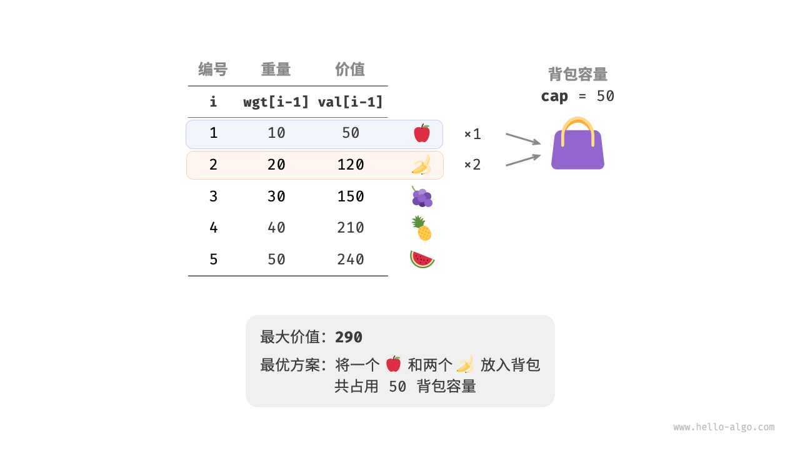

### 动态规划思路

完全背包问题和 0-1 背包问题非常相似，**区别仅在于不限制物品的选择次数**。

- 在 0-1 背包问题中，每种物品只有一个，因此将物品 $i$ 放入背包后，只能从前 $i-1$ 个物品中选择。
- 在完全背包问题中，每种物品的数量是无限的，因此将物品 $i$ 放入背包后，**仍可以从前 $i$ 个物品中选择**。

在完全背包问题的规定下，状态 $[i, c]$ 的变化分为两种情况。

- **不放入物品 $i$** ：与 0-1 背包问题相同，转移至 $[i-1, c]$ 。
- **放入物品 $i$** ：与 0-1 背包问题不同，转移至 $[i, c-wgt[i-1]]$ 。

从而状态转移方程变为：

$$
dp[i, c] = \max(dp[i-1, c], dp[i, c - wgt[i-1]] + val[i-1])
$$

### 代码实现

对比两道题目的代码，状态转移中有一处从 $i-1$ 变为 $i$ ，其余完全一致：

```python
def unbounded_knapsack_dp(wgt: list[int], val: list[int], cap: int) -> int:
    """完全背包：动态规划"""
    n = len(wgt)
    # 初始化 dp 表
    dp = [[0] * (cap + 1) for _ in range(n + 1)]
    # 状态转移
    for i in range(1, n + 1):
        for c in range(1, cap + 1):
            if wgt[i - 1] > c:
                # 若超过背包容量，则不选物品 i
                dp[i][c] = dp[i - 1][c]
            else:
                # 不选和选物品 i 这两种方案的较大值
                dp[i][c] = max(dp[i - 1][c], dp[i][c - wgt[i - 1]] + val[i - 1])
    return dp[n][cap]
```

### 空间优化

由于当前状态是从左边和上边的状态转移而来的，**因此空间优化后应该对 $dp$ 表中的每一行进行正序遍历**。

这个遍历顺序与 0-1 背包正好相反。请借助下图来理解两者的区别。

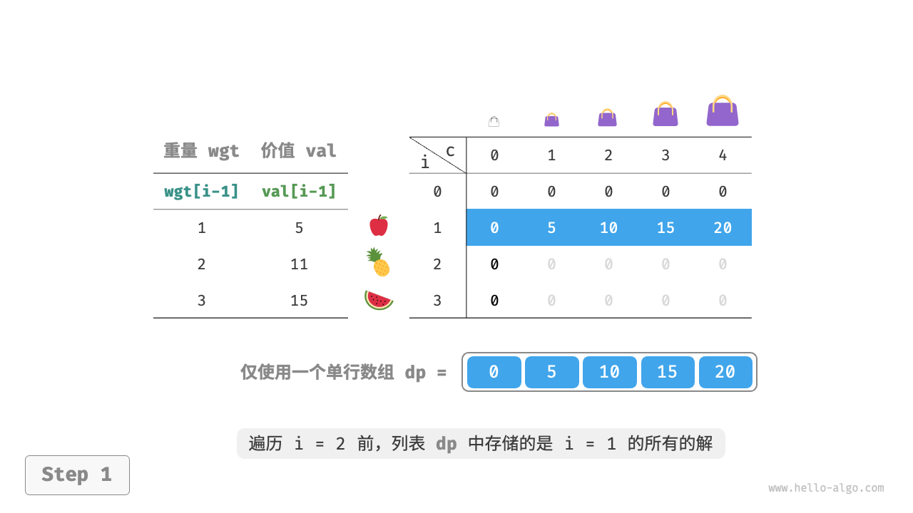

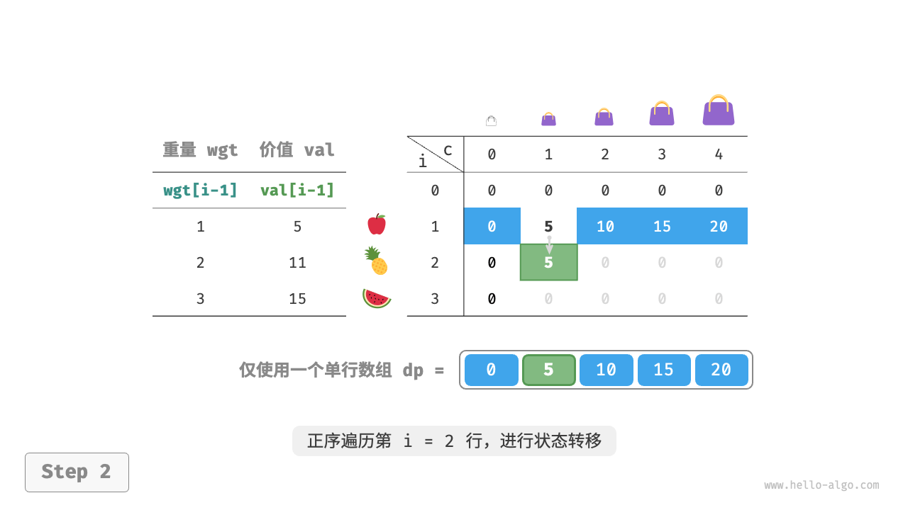

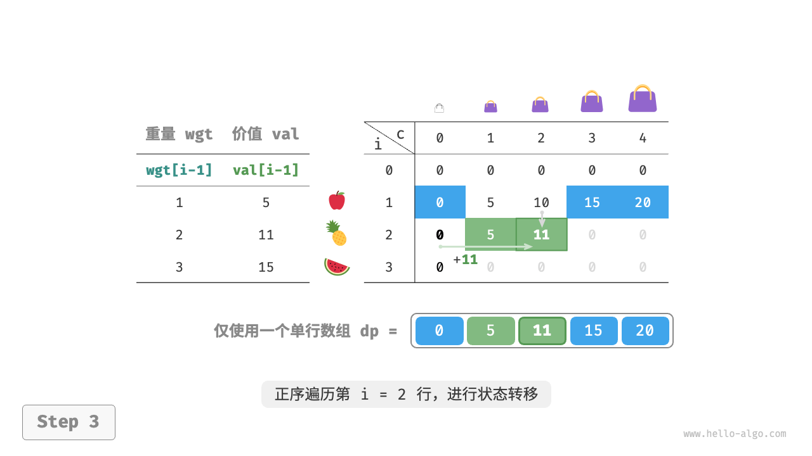

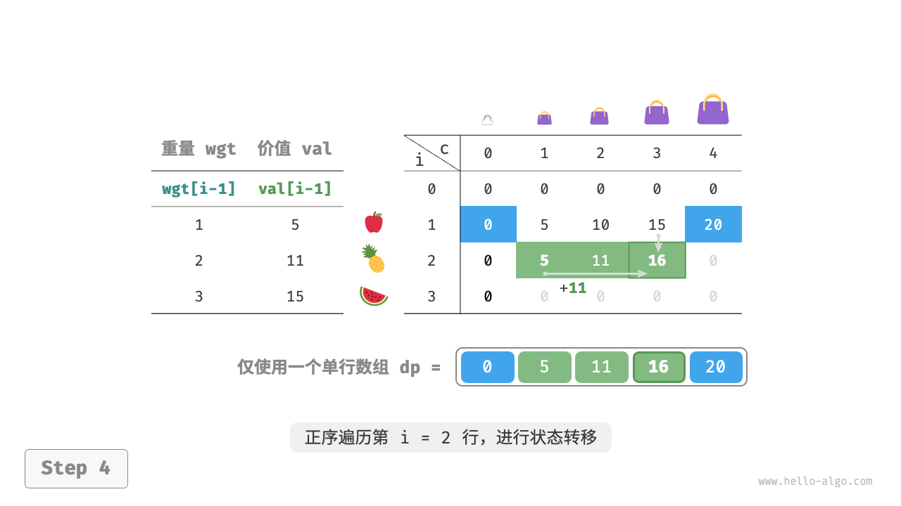

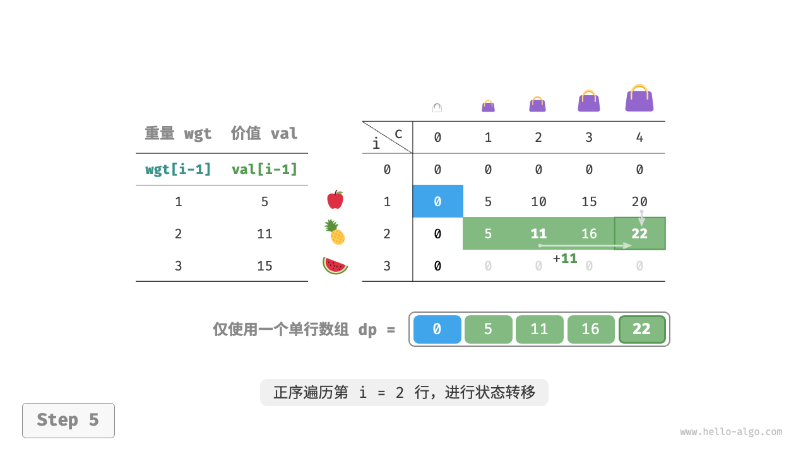

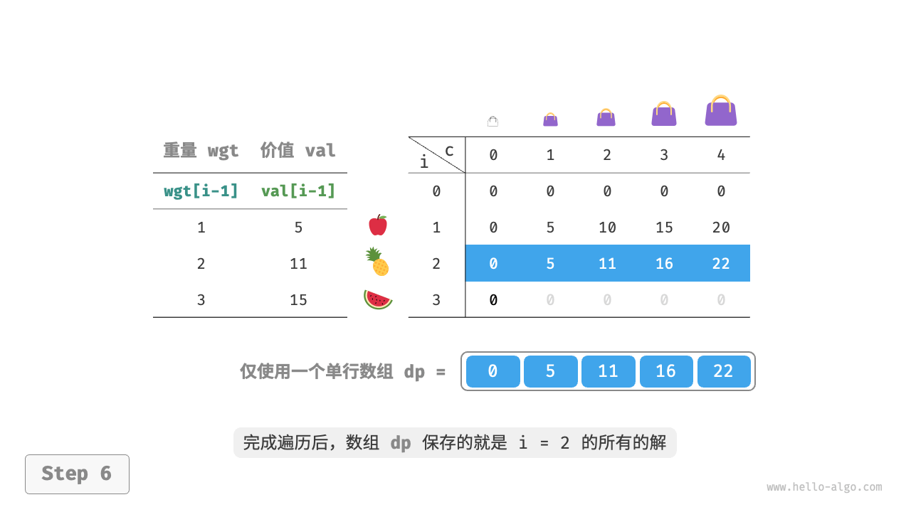

代码实现比较简单，仅需将数组 `dp` 的第一维删除：

```python
def unbounded_knapsack_dp_comp(wgt: list[int], val: list[int], cap: int) -> int:
    """完全背包：空间优化后的动态规划"""
    n = len(wgt)
    # 初始化 dp 表
    dp = [0] * (cap + 1)
    # 状态转移
    for i in range(1, n + 1):
        # 正序遍历
        for c in range(1, cap + 1):
            if wgt[i - 1] > c:
                # 若超过背包容量，则不选物品 i
                dp[c] = dp[c]
            else:
                # 不选和选物品 i 这两种方案的较大值
                dp[c] = max(dp[c], dp[c - wgt[i - 1]] + val[i - 1])
    return dp[cap]
```

## 零钱兑换问题

背包问题是一大类动态规划问题的代表，其拥有很多变种，例如零钱兑换问题。

> 给定 $n$ 种硬币，第 $i$ 种硬币的面值为 $coins[i - 1]$ ，目标金额为 $amt$ ，**每种硬币可以重复选取**，问能够凑出目标金额的最少硬币数量。如果无法凑出目标金额，则返回 $-1$ 。示例如下图所示。

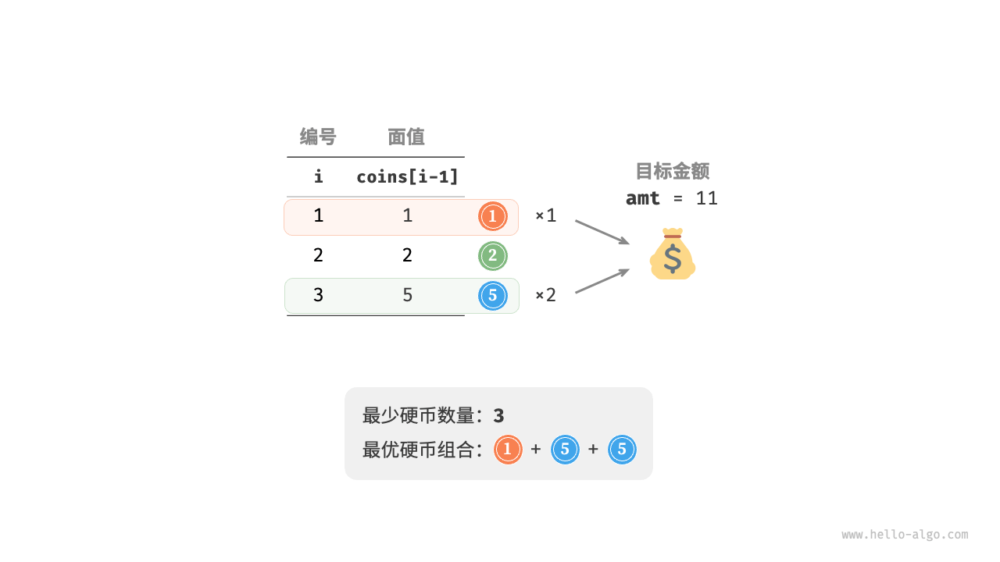

### 动态规划思路

**零钱兑换可以看作完全背包问题的一种特殊情况**，两者具有以下联系与不同点。

- 两道题可以相互转换，“物品”对应“硬币”、“物品重量”对应“硬币面值”、“背包容量”对应“目标金额”。
- 优化目标相反，完全背包问题是要最大化物品价值，零钱兑换问题是要最小化硬币数量。
- 完全背包问题是求“不超过”背包容量下的解，零钱兑换是求“恰好”凑到目标金额的解。

**第一步：思考每轮的决策，定义状态，从而得到 $dp$ 表**

状态 $[i, a]$ 对应的子问题为：**前 $i$ 种硬币能够凑出金额 $a$ 的最少硬币数量**，记为 $dp[i, a]$ 。

二维 $dp$ 表的尺寸为 $(n+1) \times (amt+1)$ 。

**第二步：找出最优子结构，进而推导出状态转移方程**

本题与完全背包问题的状态转移方程存在以下两点差异。

- 本题要求最小值，因此需将运算符 $\max()$ 更改为 $\min()$ 。
- 优化主体是硬币数量而非商品价值，因此在选中硬币时执行 $+1$ 即可。

$$
dp[i, a] = \min(dp[i-1, a], dp[i, a - coins[i-1]] + 1)
$$

**第三步：确定边界条件和状态转移顺序**

当目标金额为 $0$ 时，凑出它的最少硬币数量为 $0$ ，即首列所有 $dp[i, 0]$ 都等于 $0$ 。

当无硬币时，**无法凑出任意 $> 0$ 的目标金额**，即是无效解。为使状态转移方程中的 $\min()$ 函数能够识别并过滤无效解，我们考虑使用 $+ \infty$ 来表示它们，即令首行所有 $dp[0, a]$ 都等于 $+ \infty$ 。

### 代码实现

大多数编程语言并未提供 $+ \infty$ 变量，只能使用整型 `int` 的最大值来代替。而这又会导致大数越界：状态转移方程中的 $+ 1$ 操作可能发生溢出。

为此，我们采用数字 $amt + 1$ 来表示无效解，因为凑出 $amt$ 的硬币数量最多为 $amt$ 。最后返回前，判断 $dp[n, amt]$ 是否等于 $amt + 1$ ，若是则返回 $-1$ ，代表无法凑出目标金额。代码如下所示：

```python
def coin_change_dp(coins: list[int], amt: int) -> int:
    """零钱兑换：动态规划"""
    n = len(coins)
    MAX = amt + 1
    # 初始化 dp 表
    dp = [[0] * (amt + 1) for _ in range(n + 1)]
    # 状态转移：首行首列
    for a in range(1, amt + 1):
        dp[0][a] = MAX
    # 状态转移：其余行和列
    for i in range(1, n + 1):
        for a in range(1, amt + 1):
            if coins[i - 1] > a:
                # 若超过目标金额，则不选硬币 i
                dp[i][a] = dp[i - 1][a]
            else:
                # 不选和选硬币 i 这两种方案的较小值
                dp[i][a] = min(dp[i - 1][a], dp[i][a - coins[i - 1]] + 1)
    return dp[n][amt] if dp[n][amt] != MAX else -1
```

下图展示了零钱兑换的动态规划过程，和完全背包问题非常相似。

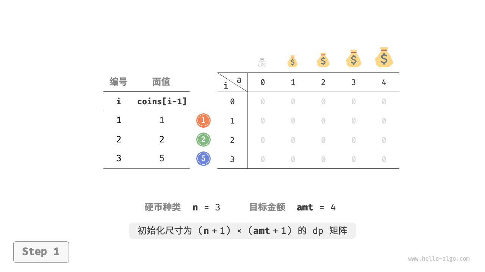

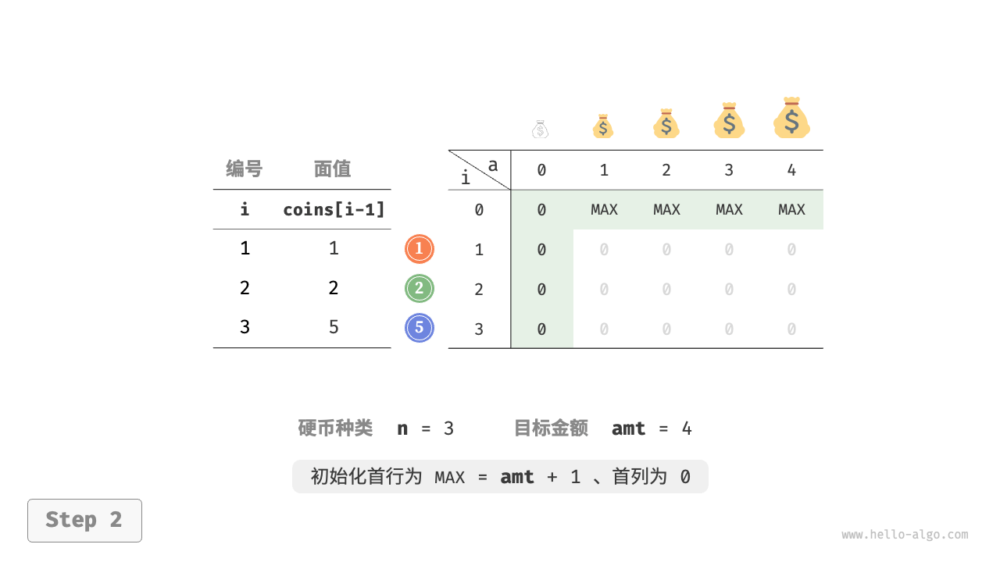

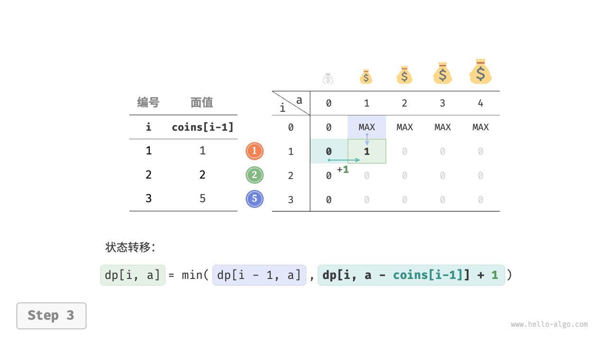

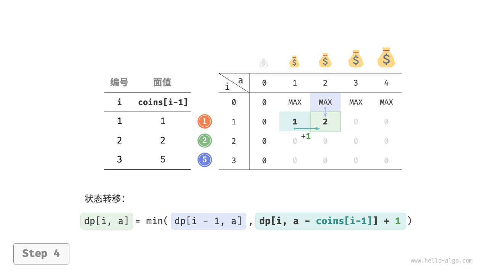

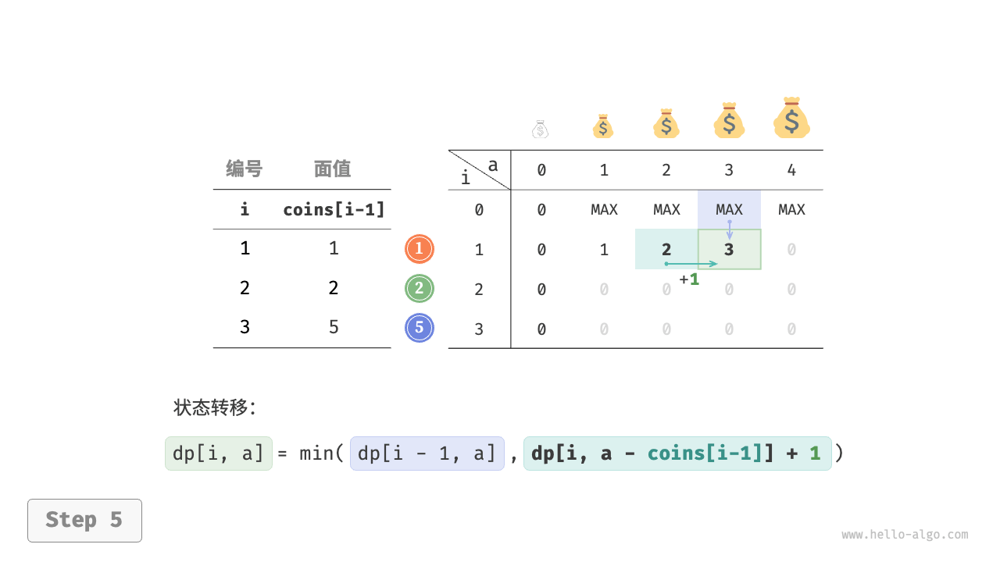


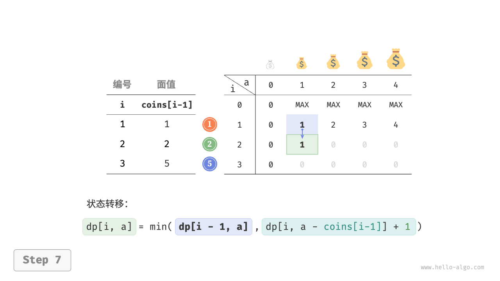

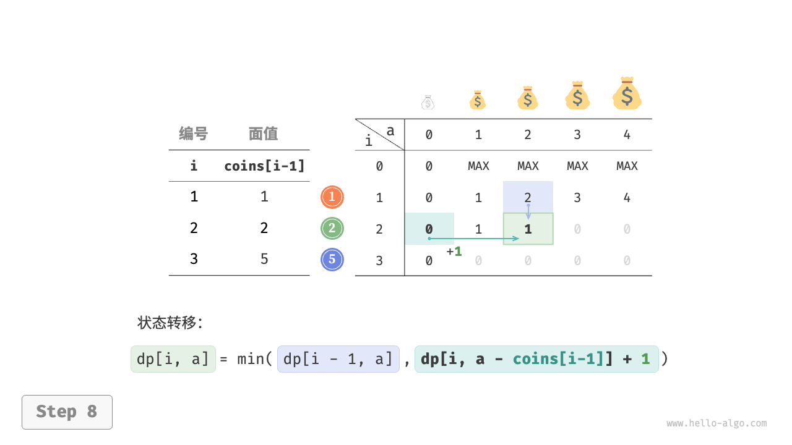

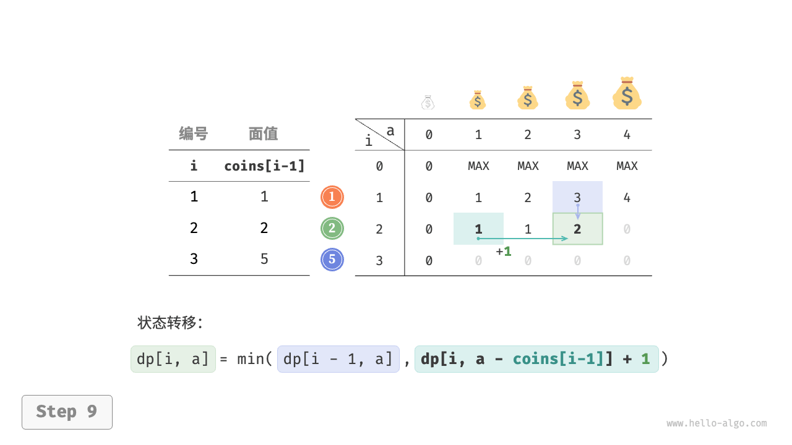

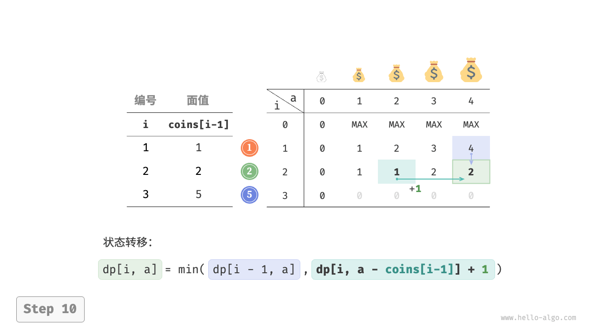

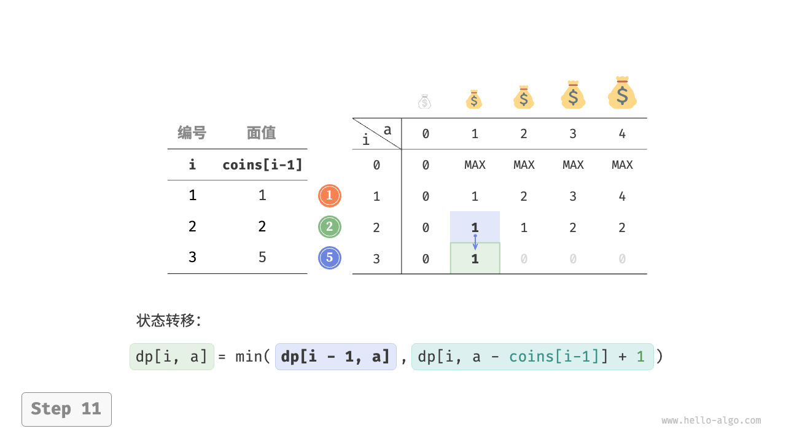

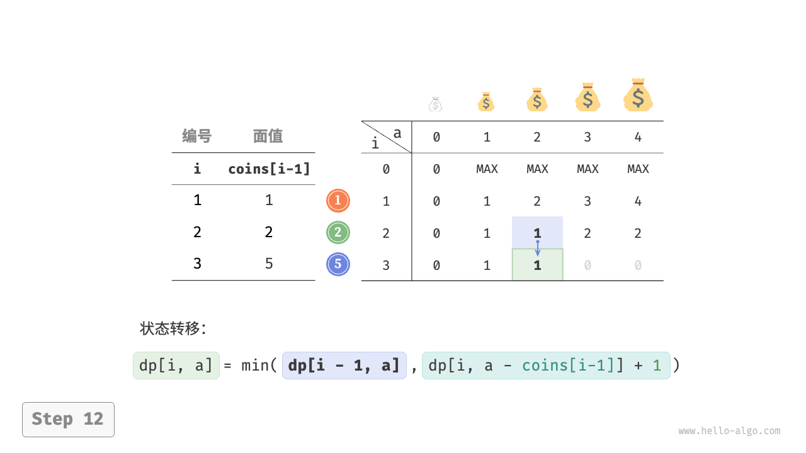

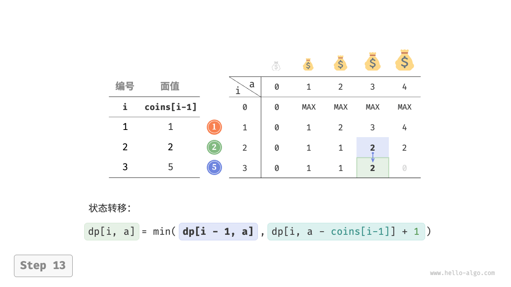

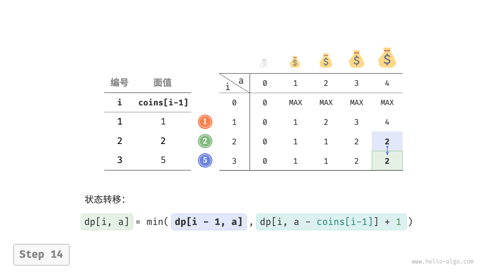

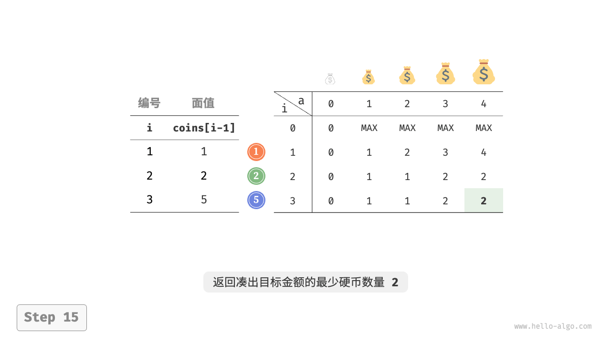
### 空间优化

零钱兑换的空间优化的处理方式和完全背包问题一致：

```python
def coin_change_dp_comp(coins: list[int], amt: int) -> int:
    """零钱兑换：空间优化后的动态规划"""
    n = len(coins)
    MAX = amt + 1
    # 初始化 dp 表
    dp = [MAX] * (amt + 1)
    dp[0] = 0
    # 状态转移
    for i in range(1, n + 1):
        # 正序遍历
        for a in range(1, amt + 1):
            if coins[i - 1] > a:
                # 若超过目标金额，则不选硬币 i
                dp[a] = dp[a]
            else:
                # 不选和选硬币 i 这两种方案的较小值
                dp[a] = min(dp[a], dp[a - coins[i - 1]] + 1)
    return dp[amt] if dp[amt] != MAX else -1
```

## 零钱兑换问题 II

> 给定 $n$ 种硬币，第 $i$ 种硬币的面值为 $coins[i - 1]$ ，目标金额为 $amt$ ，每种硬币可以重复选取，**问凑出目标金额的硬币组合数量**。示例如下图所示。

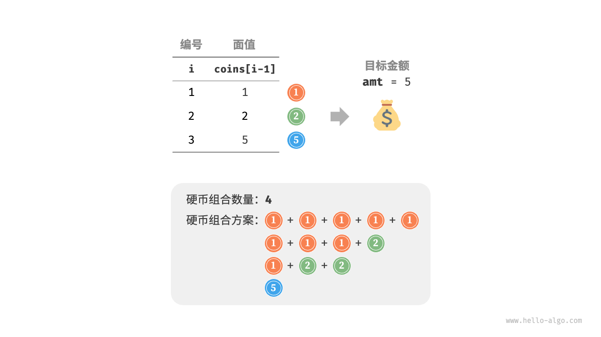

### 动态规划思路

相比于上一题，本题目标是求组合数量，因此子问题变为：**前 $i$ 种硬币能够凑出金额 $a$ 的组合数量**。而 $dp$ 表仍然是尺寸为 $(n+1) \times (amt + 1)$ 的二维矩阵。

当前状态的组合数量等于不选当前硬币与选当前硬币这两种决策的组合数量之和。状态转移方程为：

$$
dp[i, a] = dp[i-1, a] + dp[i, a - coins[i-1]]
$$

当目标金额为 $0$ 时，无须选择任何硬币即可凑出目标金额，因此应将首列所有 $dp[i, 0]$ 都初始化为 $1$ 。当无硬币时，无法凑出任何 $>0$ 的目标金额，因此首行所有 $dp[0, a]$ 都等于 $0$ 。

### 代码实现

```python
def coin_change_ii_dp(coins: list[int], amt: int) -> int:
    """零钱兑换 II：动态规划"""
    n = len(coins)
    # 初始化 dp 表
    dp = [[0] * (amt + 1) for _ in range(n + 1)]
    # 初始化首列
    for i in range(n + 1):
        dp[i][0] = 1
    # 状态转移
    for i in range(1, n + 1):
        for a in range(1, amt + 1):
            if coins[i - 1] > a:
                # 若超过目标金额，则不选硬币 i
                dp[i][a] = dp[i - 1][a]
            else:
                # 不选和选硬币 i 这两种方案之和
                dp[i][a] = dp[i - 1][a] + dp[i][a - coins[i - 1]]
    return dp[n][amt]
```

### 空间优化

空间优化处理方式相同，删除硬币维度即可：

```python
def coin_change_ii_dp_comp(coins: list[int], amt: int) -> int:
    """零钱兑换 II：空间优化后的动态规划"""
    n = len(coins)
    # 初始化 dp 表
    dp = [0] * (amt + 1)
    dp[0] = 1
    # 状态转移
    for i in range(1, n + 1):
        # 正序遍历
        for a in range(1, amt + 1):
            if coins[i - 1] > a:
                # 若超过目标金额，则不选硬币 i
                dp[a] = dp[a]
            else:
                # 不选和选硬币 i 这两种方案之和
                dp[a] = dp[a] + dp[a - coins[i - 1]]
    return dp[amt]
```