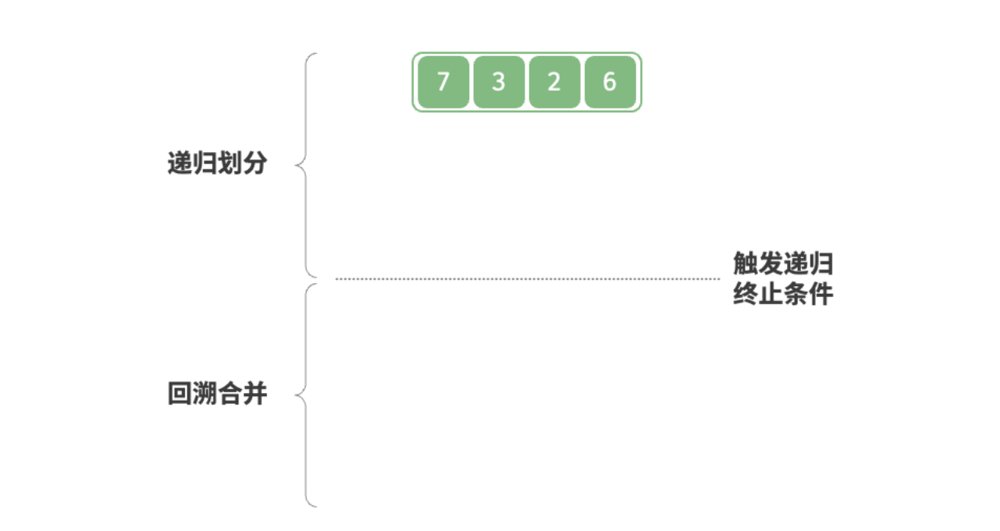
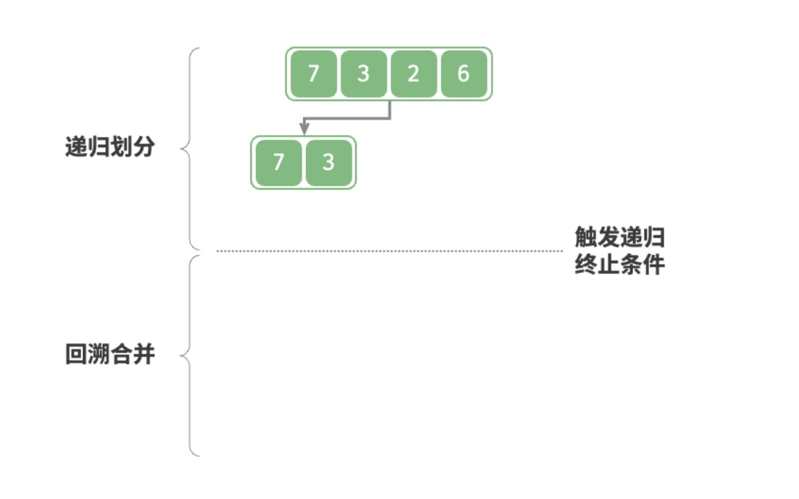
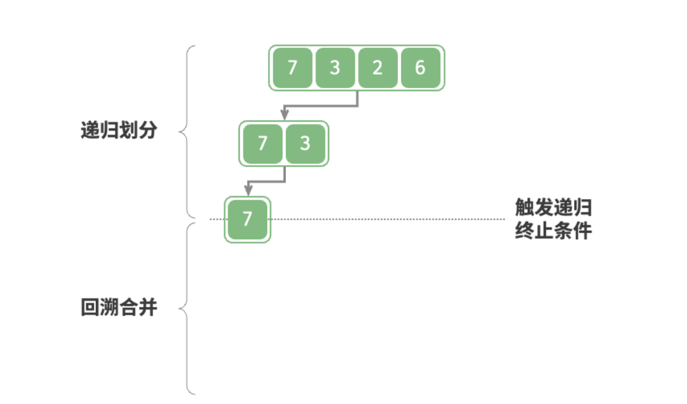
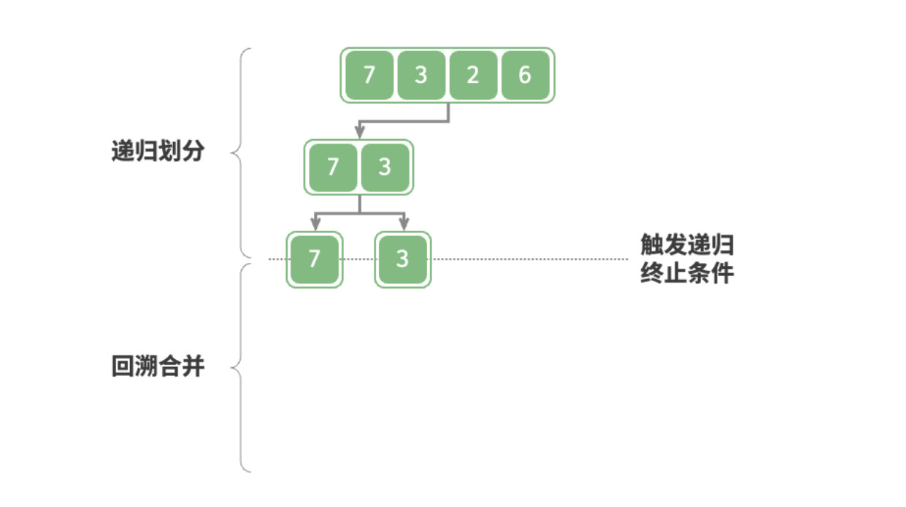
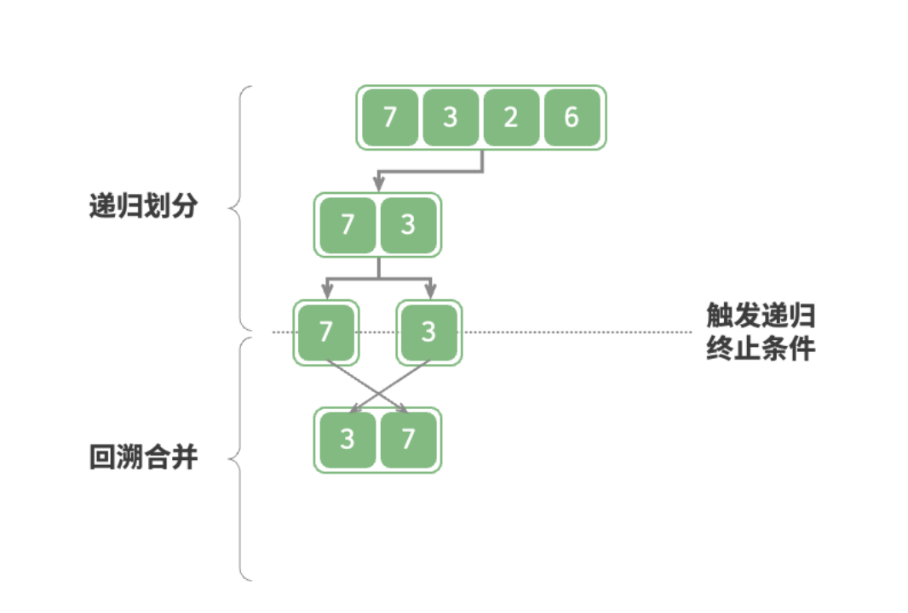
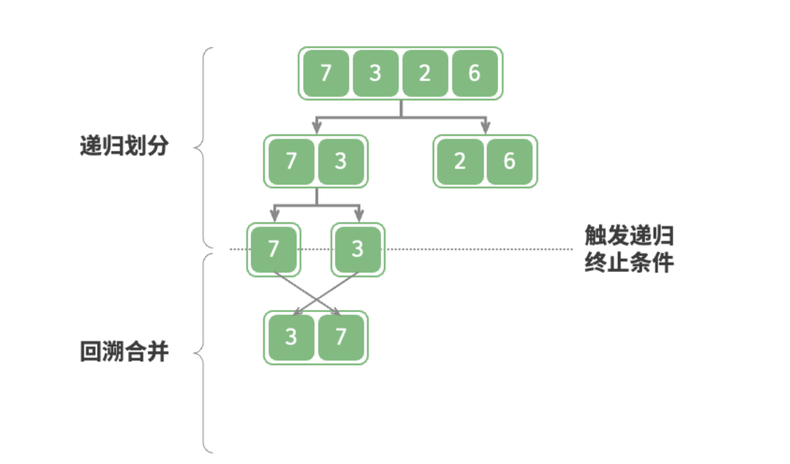
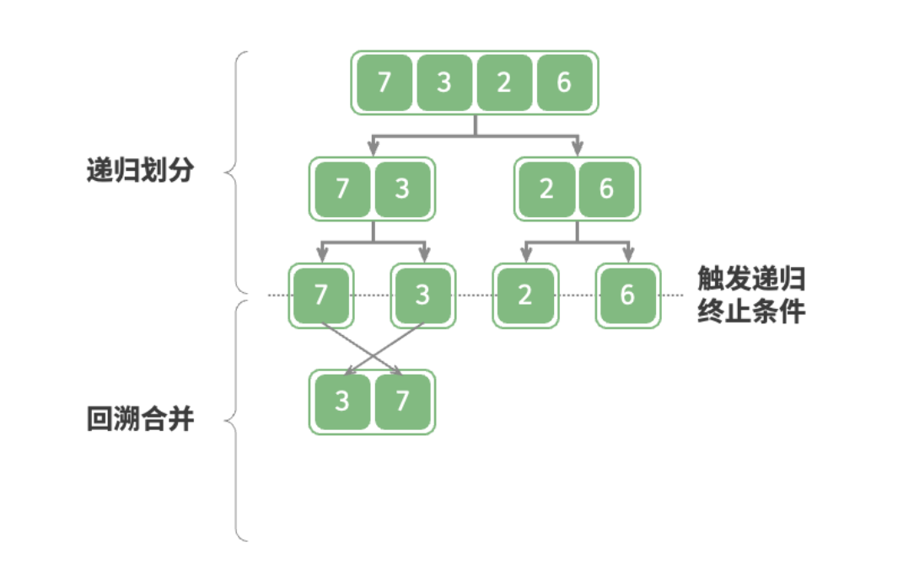
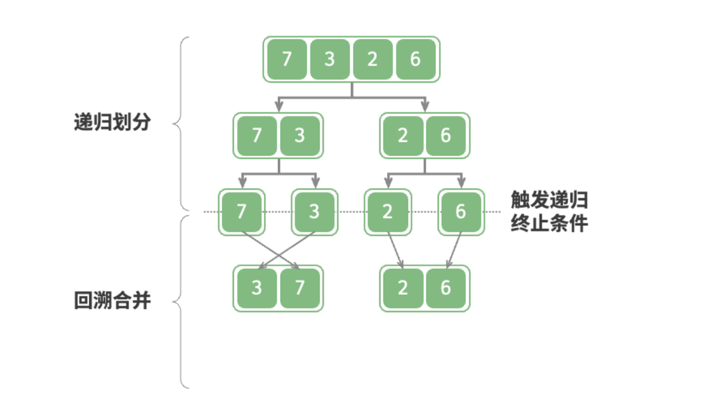
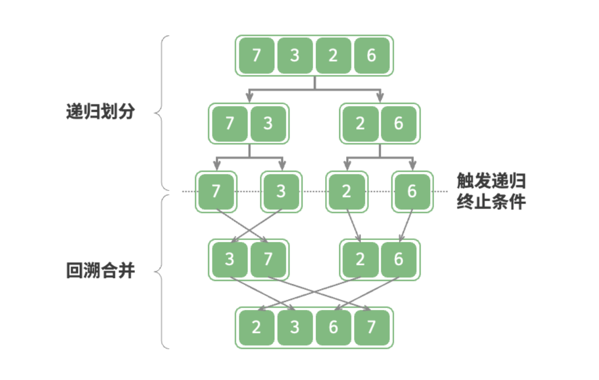

# 归并排序

<u>归并排序（merge sort）</u>是一种基于分治策略的排序算法，包含下图所示的“划分”和“合并”阶段。

1. **划分阶段**：通过递归不断地将数组从中点处分开，将长数组的排序问题转换为短数组的排序问题。
2. **合并阶段**：当子数组长度为 1 时终止划分，开始合并，持续地将左右两个较短的有序数组合并为一个较长的有序数组，直至结束。


## 算法流程

如下图所示，“划分阶段”从顶至底递归地将数组从中点切分为两个子数组。

1. 计算数组中点 `mid` ，递归划分左子数组（区间 `[left, mid]` ）和右子数组（区间 `[mid + 1, right]` ）。
2. 递归执行步骤 `1.` ，直至子数组区间长度为 1 时终止。

“合并阶段”从底至顶地将左子数组和右子数组合并为一个有序数组。需要注意的是，从长度为 1 的子数组开始合并，合并阶段中的每个子数组都是有序的。












观察发现，归并排序与二叉树后序遍历的递归顺序是一致的。

- **后序遍历**：先递归左子树，再递归右子树，最后处理根节点。
- **归并排序**：先递归左子数组，再递归右子数组，最后处理合并。

归并排序的实现如以下代码所示。请注意，`nums` 的待合并区间为 `[left, right]` ，而 `tmp` 的对应区间为 `[0, right - left]` 。

```python
def merge(nums: list[int], left: int, mid: int, right: int):
    """合并左子数组和右子数组"""
    # 左子数组区间为 [left, mid], 右子数组区间为 [mid+1, right]
    # 创建一个临时数组 tmp ，用于存放合并后的结果
    tmp = [0] * (right - left + 1)
    # 初始化左子数组和右子数组的起始索引
    i, j, k = left, mid + 1, 0
    # 当左右子数组都还有元素时，进行比较并将较小的元素复制到临时数组中
    while i <= mid and j <= right:
        if nums[i] <= nums[j]:
            tmp[k] = nums[i]
            i += 1
        else:
            tmp[k] = nums[j]
            j += 1
        k += 1
    # 将左子数组和右子数组的剩余元素复制到临时数组中
    while i <= mid:
        tmp[k] = nums[i]
        i += 1
        k += 1
    while j <= right:
        tmp[k] = nums[j]
        j += 1
        k += 1
    # 将临时数组 tmp 中的元素复制回原数组 nums 的对应区间
    for k in range(0, len(tmp)):
        nums[left + k] = tmp[k]

def merge_sort(nums: list[int], left: int, right: int):
    """归并排序"""
    # 终止条件
    if left >= right:
        return  # 当子数组长度为 1 时终止递归
    # 划分阶段
    mid = (left + right) // 2 # 计算中点
    merge_sort(nums, left, mid)  # 递归左子数组
    merge_sort(nums, mid + 1, right)  # 递归右子数组
    # 合并阶段
    merge(nums, left, mid, right)
```

## 算法特性

- **时间复杂度为 $O(n \log n)$、非自适应排序**：划分产生高度为 $\log n$ 的递归树，每层合并的总操作数量为 $n$ ，因此总体时间复杂度为 $O(n \log n)$ 。
- **空间复杂度为 $O(n)$、非原地排序**：递归深度为 $\log n$ ，使用 $O(\log n)$ 大小的栈帧空间。合并操作需要借助辅助数组实现，使用 $O(n)$ 大小的额外空间。
- **稳定排序**：在合并过程中，相等元素的次序保持不变。

## 链表排序

对于链表，归并排序相较于其他排序算法具有显著优势，**可以将链表排序任务的空间复杂度优化至 $O(1)$** 。

- **划分阶段**：可以使用“迭代”替代“递归”来实现链表划分工作，从而省去递归使用的栈帧空间。
- **合并阶段**：在链表中，节点增删操作仅需改变引用（指针）即可实现，因此合并阶段（将两个短有序链表合并为一个长有序链表）无须创建额外链表。

具体实现细节比较复杂，有兴趣的读者可以查阅相关资料进行学习。