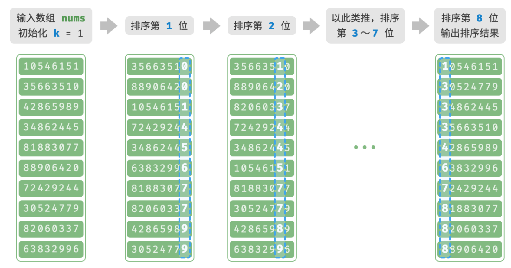

# 基数排序

上一节介绍了计数排序，它适用于数据量 $n$ 较大但数据范围 $m$ 较小的情况。假设我们需要对 $n = 10^6$ 个学号进行排序，而学号是一个 $8$ 位数字，这意味着数据范围 $m = 10^8$ 非常大，使用计数排序需要分配大量内存空间，而基数排序可以避免这种情况。

<u>基数排序（radix sort）</u>的核心思想与计数排序一致，也通过统计个数来实现排序。在此基础上，基数排序利用数字各位之间的递进关系，依次对每一位进行排序，从而得到最终的排序结果。

## 算法流程

以学号数据为例，假设数字的最低位是第 $1$ 位，最高位是第 $8$ 位，基数排序的流程如下图所示。

1. 初始化位数 $k = 1$ 。
2. 对学号的第 $k$ 位执行“计数排序”。完成后，数据会根据第 $k$ 位从小到大排序。
3. 将 $k$ 增加 $1$ ，然后返回步骤 `2.` 继续迭代，直到所有位都排序完成后结束。



下面剖析代码实现。对于一个 $d$ 进制的数字 $x$ ，要获取其第 $k$ 位 $x_k$ ，可以使用以下计算公式：

$$
x_k = \lfloor\frac{x}{d^{k-1}}\rfloor \bmod d
$$

其中 $\lfloor a \rfloor$ 表示对浮点数 $a$ 向下取整，而 $\bmod \: d$ 表示对 $d$ 取模（取余）。对于学号数据，$d = 10$ 且 $k \in [1, 8]$ 。

此外，我们需要小幅改动计数排序代码，使之可以根据数字的第 $k$ 位进行排序：

```python
def digit(num: int, exp: int) -> int:
    """获取元素 num 的第 k 位，其中 exp = 10^(k-1)"""
    # 传入 exp 而非 k 可以避免在此重复执行昂贵的次方计算
    return (num // exp) % 10

def counting_sort_digit(nums: list[int], exp: int):
    """计数排序（根据 nums 第 k 位排序）"""
    # 十进制的位范围为 0~9 ，因此需要长度为 10 的桶数组
    counter = [0] * 10
    n = len(nums)
    # 统计 0~9 各数字的出现次数
    for i in range(n):
        d = digit(nums[i], exp)  # 获取 nums[i] 第 k 位，记为 d
        counter[d] += 1  # 统计数字 d 的出现次数
    # 求前缀和，将“出现个数”转换为“数组索引”
    for i in range(1, 10):
        counter[i] += counter[i - 1]
    # 倒序遍历，根据桶内统计结果，将各元素填入 res
    res = [0] * n
    for i in range(n - 1, -1, -1):
        d = digit(nums[i], exp)
        j = counter[d] - 1  # 获取 d 在数组中的索引 j
        res[j] = nums[i]  # 将当前元素填入索引 j
        counter[d] -= 1  # 将 d 的数量减 1
    # 使用结果覆盖原数组 nums
    for i in range(n):
        nums[i] = res[i]

def radix_sort(nums: list[int]):
    """基数排序"""
    # 获取数组的最大元素，用于判断最大位数
    m = max(nums)
    # 按照从低位到高位的顺序遍历
    exp = 1
    while exp <= m:
        # 对数组元素的第 k 位执行计数排序
        # k = 1 -> exp = 1
        # k = 2 -> exp = 10
        # 即 exp = 10^(k-1)
        counting_sort_digit(nums, exp)
        exp *= 10
```

!!! question "为什么从最低位开始排序？"

    在连续的排序轮次中，后一轮排序会覆盖前一轮排序的结果。举例来说，如果第一轮排序结果 $a < b$ ，而第二轮排序结果 $a > b$ ，那么第二轮的结果将取代第一轮的结果。由于数字的高位优先级高于低位，因此应该先排序低位再排序高位。

## 算法特性

相较于计数排序，基数排序适用于数值范围较大的情况，**但前提是数据必须可以表示为固定位数的格式，且位数不能过大**。例如，浮点数不适合使用基数排序，因为其位数 $k$ 过大，可能导致时间复杂度 $O(nk) \gg O(n^2)$ 。

- **时间复杂度为 $O(nk)$、非自适应排序**：设数据量为 $n$、数据为 $d$ 进制、最大位数为 $k$ ，则对某一位执行计数排序使用 $O(n + d)$ 时间，排序所有 $k$ 位使用 $O((n + d)k)$ 时间。通常情况下，$d$ 和 $k$ 都相对较小，时间复杂度趋向 $O(n)$ 。
- **空间复杂度为 $O(n + d)$、非原地排序**：与计数排序相同，基数排序需要借助长度为 $n$ 和 $d$ 的数组 `res` 和 `counter` 。
- **稳定排序**：当计数排序稳定时，基数排序也稳定；当计数排序不稳定时，基数排序无法保证得到正确的排序结果。